# DispersionLab — 综合报告

**串联五个 Notebook 的完整技术报告**

本报告系统地整合 `DispersionLab` 项目的五个 Jupyter Notebook，围绕**"能否用 3 个物理玻璃参数 `(nd, Vd, ΔPg,F)` 充分预测折射率曲线 `n(λ)`，并支撑玻璃替换、可微设计与公差分析等下游任务"**这一核心命题展开。五个 Notebook 构成两个部分：

- **Part I** (Notebooks 1–3)：建立原始 Buchdahl 工作流 —— 拟合、玻璃替换验证、可微设计与公差。
- **Part II** (Notebooks 4–5)：审计并修复工作流中发现的锚点偏差，并通过有界残差进一步提升离锚精度。

本文不按实验时间线机械罗列数字，而是先交代每个阶段的**物理 / 数学理论基础**，再用实验结果**检验**该理论的适用性与失效边界，最后从结构和误差传播角度**分析结果的成因**。

---

## 目录

1. [项目命题与统一理论框架](#1-项目命题与统一理论框架)
2. [Notebook 01 — Buchdahl 模型建立](#2-notebook-01--buchdahl-模型建立)
3. [Notebook 02 — 玻璃替换工作流验证](#3-notebook-02--玻璃替换工作流验证)
4. [Notebook 03 — 可微设计与公差分析](#4-notebook-03--可微设计与公差分析)
5. [Notebook 04 — 锚点保留修复(Phase 1)](#5-notebook-04--锚点保留修复phase-1)
6. [Notebook 05 — 有界残差修正(Phase 2)](#6-notebook-05--有界残差修正phase-2)
7. [跨 Notebook 综合分析](#7-跨-notebook-综合分析)
8. [未来方向](#8-未来方向)

---

## 1. 项目命题与统一理论框架

### 1.1 工程命题

光学设计中，色散信息的标准承载是 Sellmeier 公式（6 个常数）或完整 (λᵢ, nᵢ) 表。但设计师心智中使用的是**三个物理描述符** `(nd, Vd, ΔPg,F)`：

| 符号 | 定义 | 物理含义 |
|:---:|:---|:---|
| `nd` | `n(λ_d)`，λ_d = 587.56 nm | d 线绝对折射率 |
| `Vd` | `(nd − 1) / (n_F − n_C)` | Abbe 数，一阶色散的倒数 |
| `P_{g,F}` | `(n_g − n_F) / (n_F − n_C)` | g/F 线相对 partial dispersion |
| `ΔP_{g,F}` | `P_{g,F} − (a + b·Vd)` | 相对 Schott 正常线的异常 partial dispersion |

问题是：这 3 个在目录中免费获得的标量是否**足以重建整条 `n(λ)` 曲线**，从而支撑镜头设计决策？

### 1.2 为什么可能成立 —— 色散的物理结构

折射率随波长的变化受**电子共振 + 振动共振**驱动。在可见光—近红外的非吸收窗口内，色散几乎完全由远紫外电子共振决定（Sellmeier 的 `λ²/(λ²−λᵢ²)` 形式）。两个重要推论：

1. **色散曲线的低维性。** 一整族玻璃的色散曲线共享少数几个共振位置，个体差异主要体现在振子强度。这意味着 `n(λ)` 实际上在一个**低维流形**上，维数远小于波长采样数。
2. **d 线附近的解析性。** 由于可见区远离所有共振点，`n(λ)` 作为 λ 的函数在 d 线附近**解析且光滑**，可以用低阶多项式高效逼近 —— 但选什么变量逼近，决定了逼近质量。

### 1.3 Buchdahl 色散坐标的理论动机

Buchdahl 坐标可以先从一个工程问题理解：我们并不想直接在波长 `λ` 上用多项式拟合 `n(λ)`。原因是 0.365--2.3 μm 的波长区间很不均匀，d 线靠近短波侧，长波端又延伸很远；如果直接用 `λ, λ², λ³...` 做展开，长波端和短波端在数值尺度上不平衡，低阶多项式很难同时照顾可见区和近红外。

Buchdahl (1954) 的做法是先把横坐标从 `λ` 换成一个更适合低阶多项式的**色散坐标**：

$$\omega(\lambda) = \frac{\lambda - \lambda_d}{1 + \alpha(\lambda - \lambda_d)}, \qquad \lambda_d = 0.5875618\,\mu m$$

这个变换不是新的物理定律，而是一个更好的坐标选择。它有三个关键作用：

1. **把 d 线放在原点。** 当 `λ = λ_d` 时，`ω = 0`。因此只要展开式写成 `n_d + ...`，模型就自动满足 `n(λ_d) = n_d`，不会把最基本的 d 线折射率拟合歪。
2. **压缩并平衡波长轴。** 当 `λ → ∞` 时，`ω → 1/α`；长波端被压缩到有限范围内。这样短波端（g 线附近）和长波端（NIR）可以在同一数值尺度上参与拟合，4 阶多项式就不会被某一端强烈支配。
3. **让系数有更清楚的分工。** 在 `ω` 坐标下，`ν₁` 主要控制主色散斜率，`ν₂` 控制主要曲率；更高阶的 `ν₃, ν₄` 则更多吸收异常 partial dispersion、UV/NIR 端部弯曲和跨玻璃的高阶形状差异。这正是后续用 `ΔP_{g,F}` 预测 `(ν₃, ν₄)` 的原因。

项目采用的 4 阶展开是：

$$n(\lambda) = n_d + \nu_1 \omega + \nu_2 \omega^2 + \nu_3 \omega^3 + \nu_4 \omega^4$$

### 1.4 为什么 "3 参数 → 4 系数" 的映射有意义

这里最容易误解的一点是：**"3 参数 → 4 系数" 不是指用三个数纯代数地解出四个未知数。** 三个目录参数本身当然不足以任意决定四个自由系数。项目真正利用的是 1.2 中的低维性假设：真实玻璃的色散曲线不是任意函数，而是落在一个由玻璃物理约束出的低维族里。因此可以从整个玻璃目录中学习高阶形状规律。

最终采用的修复后结构分两层：

1. **跨玻璃回归：** 从 `(n_d, V_d, ΔP_{g,F})` 预测高阶形状 `(ν₃, ν₄)`。
2. **锚点耦合解：** 给定 `(ν₃, ν₄)` 后，用 F−C 与 g−F 两条差分约束解出 `(ν₁, ν₂)`：

$$
M_{11}\nu_1 + M_{12}\nu_2
= \Delta n_{FC} - D_{11}\nu_3 - D_{12}\nu_4
$$

$$
M_{21}\nu_1 + M_{22}\nu_2
= \Delta n_{gF} - D_{21}\nu_3 - D_{22}\nu_4
$$

其中 `M`, `D` 来自 Buchdahl 基函数在锚点波长上的差分取值。两条方程分别对应 F−C 与 g−F 两个锚点差分约束。这一耦合确保

$$n_{\text{model}}(\lambda_F)-n_{\text{model}}(\lambda_C)\equiv \tfrac{n_d-1}{V_d},\quad
n_{\text{model}}(\lambda_g)-n_{\text{model}}(\lambda_F)\equiv P_{g,F}\tfrac{n_d-1}{V_d}$$

对**任意**预测值 `(ν₃, ν₄)` 严格成立（机器精度）。第三个锚点 `n_{\text{model}}(\lambda_d) \equiv n_d` 由常数项 `n_d` 自动满足，因为 `ω(\lambda_d)=0`。因此，`V_d` 与 `P_{g,F}` 被结构化保留，不依赖训练质量。

> **与 Notebook 01 原始实现的区别。** Notebook 01 原始流程是先用锚点解析 `ν₁, ν₂`，再加入/回归 `ν₃, ν₄`。这个顺序会让后加入的高阶项重新改变 F−C 与 g−F 差分，因此产生锚点滑移。Notebook 04 的修复不是否定 `(ν₃, ν₄)` 回归，而是把 `ν₁, ν₂` 改为在给定 `(ν₃, ν₄)` 后重新耦合求解，从而扣除高阶项在锚点上的贡献。

一句话概括：`ν₃, ν₄` 是从玻璃目录中**学出来的高阶形状**；`ν₁, ν₂` 是为满足 `V_d` 和 `P_{g,F}` 定义而**解出来的低阶系数**。报告最终的工程结论以 Notebook 04 修复后的形式为准；NB02/NB03 的原始数值仅作为 pre-fix 诊断记录保留。

### 1.5 五个 Notebook 在理论上的角色

| Notebook | 理论角色 |
|:---:|:---|
| 01 | 证明 Buchdahl 展开在目录规模下有足够容量；并定量刻画 `(n_d, V_d, ΔP_{g,F}) → (ν₃, ν₄)` 回归的泛化能力。 |
| 02 | 用 Conrady 二次光谱公式作为外部"现实检验" —— 若 3 参数模型对 S 的排序与 Sellmeier 真值不一致，模型就失败了。 |
| 03 | 把模型嵌入自动微分框架，把公差分析的**中心问题**（输出的一阶响应）从采样方法（MC）化为一次反向传播（J·Σ·Jᵀ）。 |
| 04 | 审计前三个 Notebook 中**锚点不完全保留**的结构性 bug，做出物理层面的修复，并验证修复对下游 Claim G 的放大效应。 |
| 05 | 在修复后的基线上添加一个**结构保证零锚点扰动**的神经残差，突破 4 阶多项式家族的容量上限。 |

---

## 2. Notebook 01 — Buchdahl 模型建立

**文件：** [notebooks/01_model_glass_buchdahl.ipynb](../notebooks/01_model_glass_buchdahl.ipynb)

### 2.1 理论背景

**所选假设空间的表达能力。** 对于给定阶数 K 和 α，模型函数类是

$$\mathcal{F}_{K,\alpha} = \Bigl\{\, n_d + \textstyle\sum_{k=1}^K \nu_k \omega^k(\lambda;\alpha) \,\Bigr\}$$

维度为 K+1（含 nd）。这类低阶多项式逼近的合理性可由 **Jackson 型逼近定理**提供理论背景：在有限区间上，函数越光滑，其最佳 K 阶多项式逼近误差下降越快；若函数在该区间附近解析，误差通常可以接近几何级数式衰减。Sellmeier 曲线在可见光到近红外非吸收区远离共振极点，换到紧凑的 Buchdahl 坐标后 `n(ω)` 仍是光滑函数，因此用低阶多项式逼近是有理论依据的。这里需要强调：Jackson 理论只说明**低阶逼近值得尝试**，并不直接证明 Order 4 必然最优；本项目的具体阶数由 Test A 的波长留出实验确定。α 的作用则是让 ω 域更紧凑、更平衡，从而改善低阶多项式的逼近条件。

**为什么需要两种不同的"误差"。** 端到端的 `n(λ)` 误差由两部分组成：

$$\underbrace{\|n - n_{\text{fit}}\|}_{\text{拟合层}} + \underbrace{\|n_{\text{fit}} - n_{\text{pred}}\|}_{\text{回归层}}$$

拟合层反映 `F_{K,α}` 的**表达能力**（单条曲线在假设空间中可被近似到多好）；回归层反映 `(n_d, V_d, ΔP_{g,F}) → (ν₃, ν₄)` 的**跨玻璃可预测性**。本 notebook 把这两层**分开测量**，是整个项目方法论的基础。

**过拟合与容量的先验推理。** 每条玻璃曲线只在 17 个波长点上采样，而 4 阶 Buchdahl 已经使用 `ν₁...ν₄` 四个形状自由度来解释主要色散结构。换言之，拟合后的残差空间只有约 `17 − 4 = 13` 个自由方向；继续加入 order-5、order-6 等高阶项会快速增加模型贴合这 17 个采样点的能力。由于 Sellmeier 重算仍有有限数值精度（~1e-6），目录数据也存在记录误差和分布偏移，高阶项很可能先学到采样噪声或端点偶然误差，而不是真实色散规律。因此，Order-5+ 是否真的有泛化收益不能靠训练误差判断，必须用 Test A 的波长留出实验检测：若留出误差相对训练误差明显升高，就说明模型开始过拟合采样网格。

### 2.2 实验设计与核心发现

本节的实验不是一次性给出最终误差，而是按三个层次逐步排除风险：

1. **先测拟合层。** 如果已经知道某块玻璃的完整 Sellmeier 曲线，Buchdahl 函数族本身能把这条曲线拟合到多好？这一步回答"模型形式有没有足够表达能力"。
2. **再测波长泛化。** 如果从 17 个波长点里藏掉一个点，模型能否预测这个没见过的波长？这一步回答"高阶模型是不是只在贴采样点"。
3. **最后测玻璃泛化。** 如果整块玻璃在训练时没见过，只给 `(n_d, V_d, ΔP_{g,F})`，回归模型能否预测它的 Buchdahl 高阶形状？这一步回答"三参数回归能不能用于新玻璃"。

因此，下面的表格应按"拟合层 → Test A → Test B → 端到端"的顺序读：前两步选择可靠的 Buchdahl 阶数，Test B 检查三参数回归的泛化，端到端误差则汇总完整工作流的最终表现。

**数据：** 543 条有效玻璃曲线（从 Optiland 649 条中按 0.365–2.3 μm 完整 Sellmeier 支撑筛选得到；并剔除异常条目 L-BAL43，其目录 ΔP_{g,F} = 0.5415，重算 ≈ −0.002）。

**Plot 1 — 目录 3D 足迹 (nd, Vd, ΔPg,F) + 凸包。**
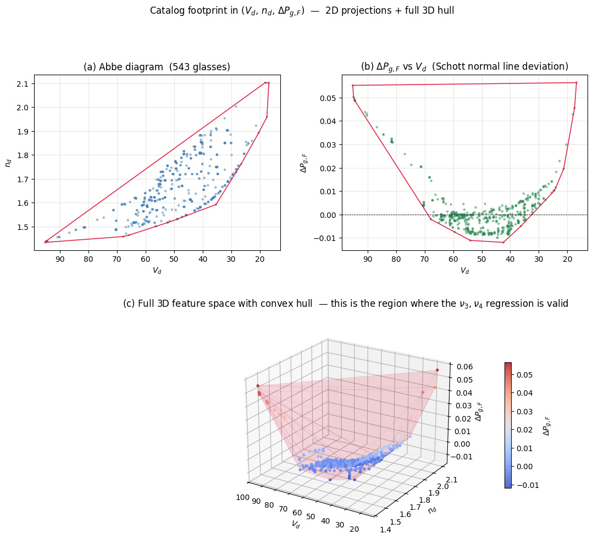
*视觉分析：左上 Abbe 图显示典型的"逗号"分布（高 Vd 低 nd → 低 Vd 高 nd 的连续带）；右上 dPgF vs Vd 子图清晰勾出 Schott 正常线及其上方的 FK 簇（ΔPg,F > 0.03 的孤立点群）。下方 3D 图揭示凸包在 **高-Vd 且正 dPgF** 的角上非常稀疏 —— 正是这个稀疏区使 Notebook 02 Claim D 的连续最优落到凸包外。*

**拟合层（α 与阶数的联合优化）：** 对每条玻璃直接拟合 Buchdahl 系数，比较不同阶数和不同 `α` 下的最大重建误差。这一步只评价函数族表达能力，不评价三参数回归。

| Order | Best α | Max Err (α_opt) | Max Err (α=2.5) | 提升 |
|:---:|:---:|:---:|:---:|:---:|
| 2 | 2.591 | 8.19e-03 | 8.42e-03 | 1.0× |
| 3 | 1.933 | 3.58e-03 | 5.65e-03 | 1.6× |
| **4** | **1.818** | **2.39e-03** | 2.99e-03 | 1.2× |
| 5 | 1.560 | 6.53e-04 | 2.03e-03 | 3.1× |

**Plot 2 — 4 条代表玻璃的残差 vs 波长（orders 2/3/4）。**
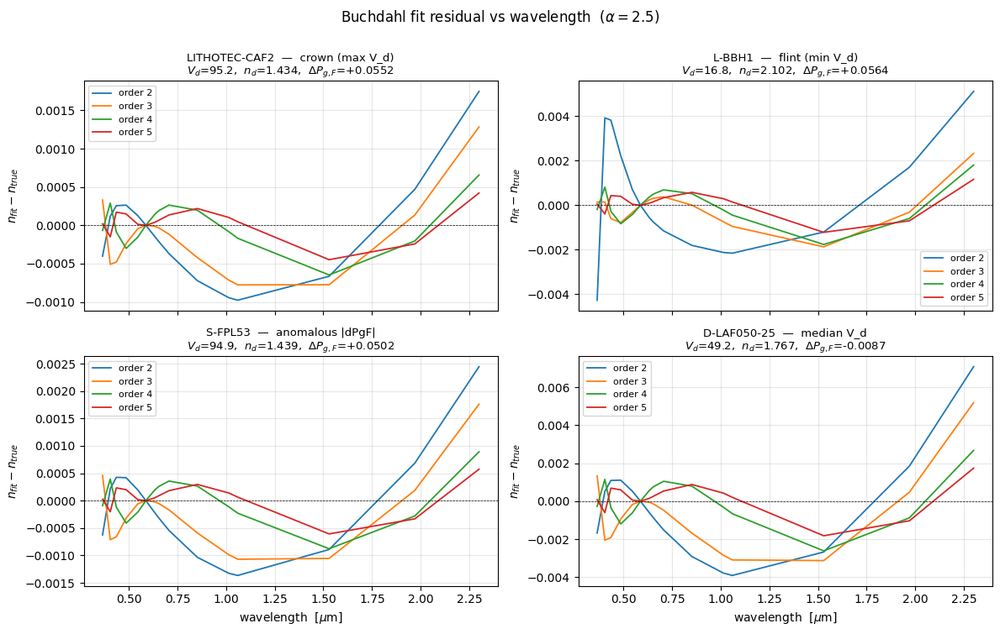
*视觉分析：所有四条子图的残差曲线在 order 4 处**幅度降到 ±0.0002 以内**，且呈现 order-k 多项式逼近特有的"k+1 次摆动"特征（order 4 残差在可见区有 5 个局部极值）—— 这是 Chebyshev 等振荡定理的数值印证。误差集中于 UV (< 0.4 μm) 与 NIR (> 1.8 μm) 端，可见区 (0.4–0.7 μm) 残差极小。*

**Plot 3 — 阶数收敛曲线（α = 2.5，log-y）。**
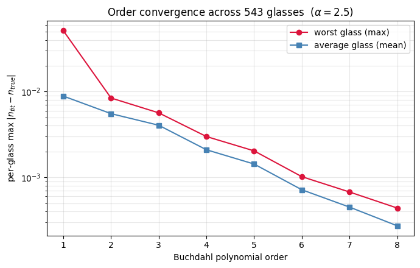
*视觉分析：max（红）与 mean（蓝）曲线**近似平行**下降约 2 个数量级（5e-2 → 4e-4），表明目录内"最坏玻璃"与"平均玻璃"的误差以相同速率收敛 —— 不存在某种病态玻璃拖累整体阶数选择。*

**Plot 4 — α 优化曲线（orders 2–5）。**
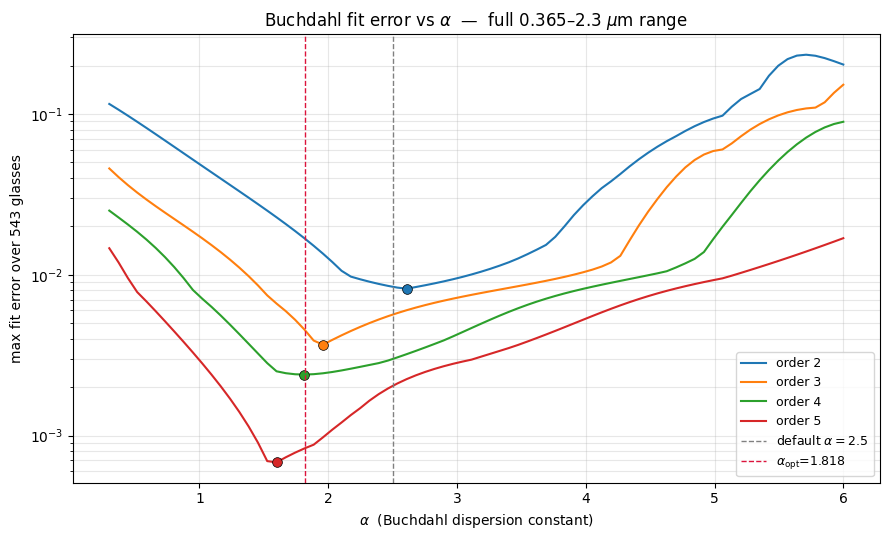
*视觉分析：每一阶都呈现清晰的 V 形谷；order 4（绿）谷底在 α ≈ 1.8 处**宽而平坦** —— 意味着 ±0.2 的 α 波动几乎不影响拟合质量，**工程上鲁棒**。order 5（红）谷底更低但更陡峭，对 α 选择敏感，说明 order 5 的"优势"建立在精确调参之上，可复现性差。*

**Plot 5 — α = 2.5 vs α_opt 逐阶收敛对比。**
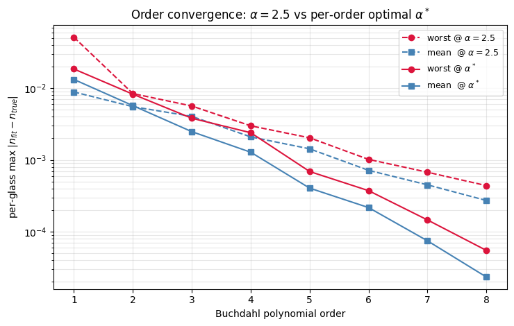
*视觉分析：在 order 2–3 处 α-优化几乎无收益（虚实线几乎重合）；从 order 4 开始分叉越来越大，到 order 6 α-优化的 mean 已领先 α=2.5 约 3×。**这证明 α 优化的价值随阶数放大**，同时也解释了为什么高阶 Buchdahl 文献常强调 α 需按应用重新标定。*

**Test A（17 点留一波长）——过拟合的边界：** 每次从 17 个波长采样中留出一个点，用剩余 16 个点拟合，再测试被留出波长上的误差。`hold / train` 接近 1 表示模型对未见波长也稳定；该比值明显升高则说明模型开始贴采样网格。

- Order 4：hold / train 比 ≈ 1.0×（留出等于训练，无过拟合）。
- Order 5：比率 3.8×；Order 6+：比率升至 10²–10⁴ 级。

**Plot 6 — Test A 波长留出（orders 2–8）。**
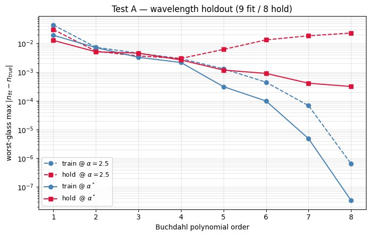
*视觉分析：在 order 1–4，所有四条曲线（train / hold × α=2.5 / α\*）几乎贴合，hold 与 train 同步下降。**从 order 5 开始 α=2.5 的 hold 曲线（红方虚线）陡然反转上升**，到 order 8 已爬升至 ~3e-2，同时 train 降到 ~1e-7 —— 经典过拟合 "U 型"。α\* 的 hold（红方实线）稍好但仍在 order 4 后转为平台，且与 train 分离 4 个量级。这张图在视觉上明确指示 order 4 是"hold 仍跟 train"的**最后一个安全阶数**。*

**Test B（玻璃级 5-fold CV）——回归泛化：** 把 543 块玻璃分成 5 份，每次用 4 份训练 `(n_d, V_d, ΔP_{g,F}) → (ν₃, ν₄)` 回归，用剩下 1 份作为完全未见过的新玻璃测试。表中 `In-Fold` / `Out-of-Fold` 分别是训练玻璃 / 未见玻璃的误差分布；`Percentile` 是各列误差的百分位（50% = 中位数，95%/99% = 尾部，`max` = 最差玻璃），`Ratio` 是同一百分位上的 `Out-of-Fold / In-Fold`。

| Percentile | In-Fold | Out-of-Fold | Ratio |
|:---:|:---:|:---:|:---:|
| 50 % | 2.20e-03 | 2.20e-03 | 1.00 |
| 95 % | 3.64e-03 | 3.72e-03 | 1.02 |
| 99 % | 4.71e-03 | 4.84e-03 | 1.03 |
| max | 7.66e-03 | 1.62e-02 | 2.12 |

**Plot 7 — (ν₃, ν₄) 回归残差热图。**
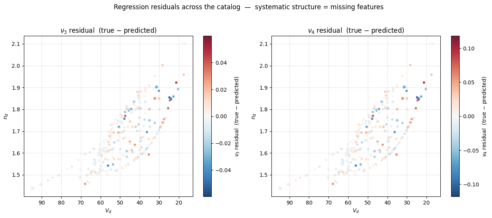
*视觉分析：ν₃ 子图整体淡色（残差 ~ ±0.02 级），但有**系统性结构**：高 nd 低 Vd（图右下火石带）上出现成簇的深红（正残差），高 Vd 低 nd（图左上 FK 区）出现深蓝（负残差）。ν₄ 残差幅度更大（~0.1 级）且结构更显著。标题"systematic structure = missing features"准确描述 —— 这些方向性残差不是随机噪声，而暗示 3 参数之外存在未被编码的物理信息；Phase 2 的残差修正正是试图吃掉这部分剩余结构。*

**Plot 9 — Test B 回归泛化 5-fold CV。**
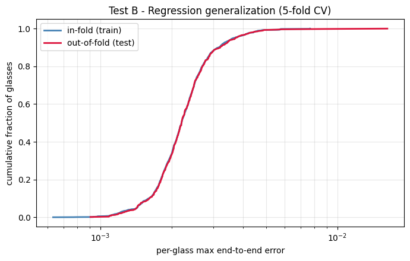
*视觉分析：两条 CDF 曲线（in-fold 蓝、out-of-fold 红）**完全重合到视觉无法分辨** —— 除了 100 百分位尾部有微小分叉。这是 "3 参数到 (ν₃, ν₄) 回归能泛化"的最直接视觉证据；表面上只是两条线，但两条线完全重合本身就是 1.03× 比率在定性上的表达。*

**端到端误差（最终采用 α = 1.818，Order 4）：** 从三个目录参数出发，经过高阶系数回归、锚点系数构造，再重建整条 `n(λ)` 并与 Sellmeier 真值比较。这是完整"三参数输入 → 曲线输出"任务的总误差。

| Method | Max | Mean |
|:---|:---:|:---:|
| Chebyshev (20-dim → 9 coefs) | 0.1955 | 0.0125 |
| Buchdahl + reg (α = 2.5) | 0.00759 | 0.00338 |
| **Buchdahl + reg (α = 1.818)** | **0.00766** | **0.00231** |

阈值内玻璃数：`< 5e-3: 539/543 (99 %)`，`< 1e-2: 543/543 (100 %)`。

**Plot 8 — 端到端误差 CDF + Abbe 图按误差着色。**
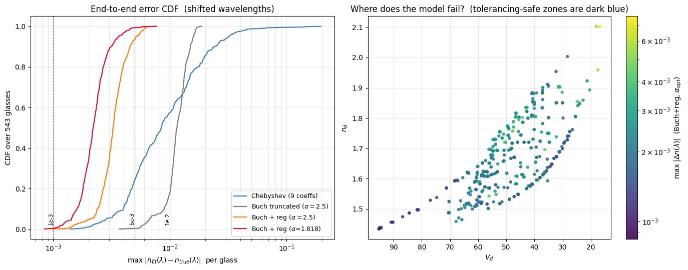
*视觉分析：左 CDF 图中四条曲线**从左到右的顺序**即从好到差：红（Buch+reg α=1.818）→ 橙（Buch+reg α=2.5）→ 灰（Buch 截断）→ 蓝（Chebyshev）。红色曲线在 5e-3 处已达 99%，蓝色曲线直到 1e-1 才饱和 —— **Chebyshev 与 Buchdahl 在 CDF 上横跨近 2 个量级**。右 Abbe 图显示"黄绿色"（高误差 > 5e-3）仅集中在两个角：(1) 极右侧 nd ≈ 2.1, Vd < 25 的高折射率火石；(2) 极端 nd 点；(3) 少数 dPgF 异常玻璃。中央主带 (nd 1.55-1.75, Vd 35-70) 整片深紫色，**模型在标准设计空间的误差 < 1×10⁻³**。这张图直接给设计师"哪些玻璃用模型来公差分析安全"的直观答案。*

### 2.3 分析

**为什么 α = 1.818 而非经典的 2.5。** 波长范围决定 ω 域的端点不对称程度。从 0.365 到 2.3 μm 的非对称区间（d 线偏短波侧）下，α = 2.5 让 ω 范围 `[−0.50, +0.32]` 明显负偏；α = 1.818 平衡到 `[−0.37, +0.42]`，对 4 阶多项式的 Chebyshev-like 最佳逼近常数最小（由最大模极值集中到区间端点附近）。这不是数据驱动的结果，而是**函数逼近理论**的预期。

**为什么 Order 4 是当前协议下的有效上限。** 每条曲线只有 17 个波长采样点，而 4 阶 Buchdahl 已使用 `ν₁...ν₄` 四个形状自由度解释主要色散结构，残差空间约为 `17 − 4 = 13` 个自由方向。从**有效自由度**角度，Order 5 已经开始消耗有限的残差检验空间，Order 6+ 的优化更容易贴合采样噪声或端点偶然误差 —— Test A 的 3.8× 跳跃是这一临界现象的显式指标。注意：此"上限"的范围是**当前数据量 + 当前 17 波长采样 + 当前正则设置**。在更密的波长网格（≥ 30 点）或对 `ν_{k≥3}` 加结构正则后，更高阶 Buchdahl 仍可能带来收益 —— 但那已是另一协议下的实验（见 §8 未来方向）。

**两种 Chebyshev 比较：区分"拟合层"与"端到端"。** 容易混淆之处：Chebyshev 的拟合层（逐玻璃直接最小二乘）确实**优于** Buchdahl —— Chebyshev 多项式在 `[−1, 1]` 上给出 `n(λ)` 的近最佳一致逼近，其逐条曲线残差比 4 阶 Buchdahl 小 10× 以上。但这是两种不同任务的结果：

| 任务 | Chebyshev | Buchdahl |
|:---|:---:|:---:|
| 逐玻璃直接拟合（拟合层） | **优** | 劣 |
| 从 3 参数回归恢复系数（端到端） | **差** | 优 |

端到端表格中 Chebyshev 的失败发生在第二个任务上：Chebyshev 系数是"**数学假象**"——它们与物理量 `(n_d, V_d, ΔP_{g,F})` 没有直接线性关系，无法从 3 参数回归恢复。Buchdahl 的优势是**跨玻璃可回归性**：`(ν₁, ν₂)` 由锚点耦合解严格保留物理定义，`(ν₃, ν₄)` 描述异常色散 —— 正好是 ΔP_{g,F} 编码的信息。**拟合能力不等于下游可用性**，这是全篇反复验证的方法论主题。

**Test B 的结构意义。** 99 百分位处 train/test 比率 1.03× 意味着：当新玻璃的 `(n_d, V_d, ΔP_{g,F})` 进入训练集凸包内时，模型的泛化是**统计上成立**的。极端尾部（100 百分位 ratio = 2.12）对应凸包外推 —— 这在 Notebook 02 的 Claim D 与 Notebook 04 的 FK 外推测试中得到重现。从 Plot 9 的视觉上看，两条 CDF 完全重叠到视觉不可辨，这是泛化成功的直观图形证据。

**Test A 的 U 形揭示。** Plot 6：α=2.5 的 hold 曲线在 order 4 达到最小值 ~3e-3 后**拐头向上**，到 order 8 已涨到 ~3e-2（高了一个量级）；而 train 曲线持续下降到 1e-7。这种经典的 U 形**偏差-方差权衡曲线**表明：在当前 17 波长网格下，order > 4 后模型开始拟合采样噪声。因此 order 4 不是"经验拍脑袋"，而是**该曲线拐点处、当前协议下的最优阶数**。

### 2.4 小结

Notebook 01 不仅"跑通"Buchdahl 模型，更回答了两个结构性问题：(a) 在可用的 17 波长网格和 543 玻璃样本下，**Order 4 + α=1.818** 是函数逼近理论与统计泛化理论共同决定的甜点；(b) 3 参数到 4 系数的分层映射是可泛化的，99 百分位 CV 比率 1.03× 给出该论点的严格数值边界。

但该 notebook 未能检测的一个隐蔽结构性缺陷 —— 锚点保留不严格 —— 将在 Notebook 04 被揭示并修复。

---

## 3. Notebook 02 — 玻璃替换工作流验证

**文件：** [notebooks/02_glass_substitution_workflow.ipynb](../notebooks/02_glass_substitution_workflow.ipynb)

> **⚠ Pre-fix 证据的有效范围。** 本 notebook 运行于 Notebook 04 锚点修复**之前**。其结论可分两类：
> - **仍然有效（独立于锚点 bug）：** 玻璃排序、FK 族识别、Claim B 的 r = −0.938 物理趋势、Claim D 的凸包外推警告、Claim E 的局部光滑性**判断本身**（即"可用 J·Σ·Jᵀ 做一阶公差"这个结论）。排序/分类类指标对 Vd 的绝对偏差相对鲁棒，修复前后保持一致（NB04 Claim G 表显示 Spearman 从 0.955 提到 0.998，但 top-3 与 FK/10 已在 0.955 下完全正确）。注意 Claim E 里的具体 `σ_S = 0.07 μm` 等数值同样属于 pre-fix 诊断结果，修复后需在同一台架上重算才算工程数字。
> - **已被 NB04 取代：** 所有**绝对** S 数值（例如 top-3 玻璃的 `S_Buchdahl ≈ 29.8 μm`），因锚点滑移包含 ~10 μm 系统偏置。修复后同一台架下的误差评估见 NB04 §5.2 Claim G 表（median/max \|ΔS\| vs Sellmeier 真值）。
>
> 本节保留原数值作为"bug 如何表现在工作流中"的诊断记录，而非最终工程数据。

### 3.1 理论背景 —— 为什么消色差 / 二次光谱是最好的现实检验

**薄透镜消色差方程。** 对胶合双胶合镜（两个薄透镜，焦距 `f₁, f₂`，Abbe 数 `V₁, V₂`），**主色差消除**的条件是

$$\frac{\varphi_1}{V_1} + \frac{\varphi_2}{V_2} = 0, \qquad \varphi_i = 1/f_i.$$

这已经只用到了 `V_d`，不依赖完整色散曲线。因此消色差设计**本身不是一个严格的色散模型测试**。

**二次光谱 —— 首个依赖 ΔP_{g,F} 的量。** 主消色差之后的残余聚焦偏差（在 g 线的 BFL 相对 d 线的偏移）由 Conrady 公式给出：

$$S \;\approx\; f \cdot \frac{P_{g,F}^{(1)} - P_{g,F}^{(2)}}{V_1 - V_2}$$

这里 `P_{g,F}` 是 partial dispersion ratio。**S 的大小和符号直接依赖于 ΔP_{g,F} 的差异** —— 这正是 3 参数模型第三个参数的真实物理意义。若模型对 `P_{g,F}` 预测有偏，S 就会系统性偏差。

**阿波罗型（apochromatic）与异常色散玻璃的必要性。** `S = 0` 要求 `P^{(1)}_{g,F} = P^{(2)}_{g,F}`。在 Schott 正常线附近的常规玻璃，此条件不可能满足（因正常线上 `P = a + b V`，两个不同 V 的玻璃 P 必不相等）。只有偏离正常线的 FK / KZFS / FPL 族（富含 CaF₂ 或氟化物的异常色散玻璃）才能组出 apo 对。**Notebook 02 的 Claim C 即是一个独立外部检验：若模型自动把 FK 族挑到最前，则模型的 `P_{g,F}` 结构与业界一致**。该检验的结果不依赖于模型的训练损失，因而是对 3 参数语义的独立验证。

**等级相关性 vs 绝对值误差。** 在典型 EFL=20 mm 台架上 S 数量级为 20–70 μm；绝对值误差 5–10 μm 不罕见，但如果**排序**与真值一致，模型仍然是可用的决策工具。这就是为什么 Claim C 强调 Spearman 相关而非 RMSE。（后文 Notebook 04 将揭示：此处的 ~6 μm **系统性偏移**并非模型固有，而是锚点滑移所致；修复后系统偏置基本消失，剩余误差降到约 1.5 μm 的 4 阶 Buchdahl 家族残差。）

### 3.2 实验设计与核心发现

**Claim A：先确认 `n(λ)` 预测不会直接破坏下游设计。** Notebook 02 先用 N-BK7 在 400–700 nm 可见光波段做 sanity check：max err = 3.63e-04，RMS = 1.52e-04，低于本节采用的 `5e-3` 预算。这个检查只能说明模型在一块常规玻璃上足够平滑、量级正确；它不能单独证明 FK/KZFS 等异常色散玻璃也完全可靠。

**Figure 1 — Claim A：N-BK7 Buchdahl vs Sellmeier。**
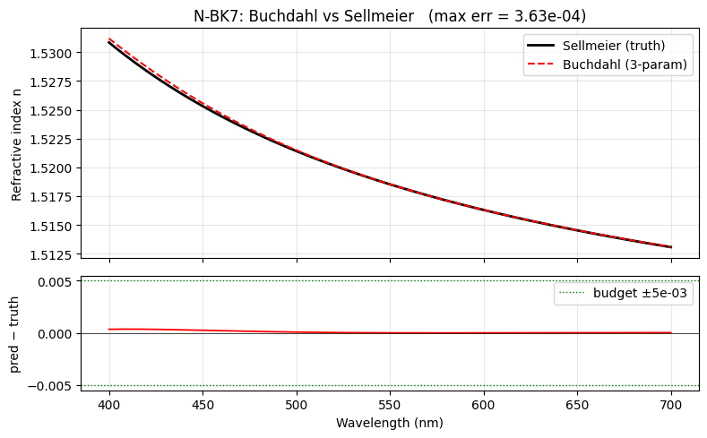
*视觉分析：上图 Sellmeier（黑实）与 Buchdahl（红虚）曲线在 400–700 nm 全程**几乎重合**，视觉无法分辨；下图残差带紧贴零线，远小于 ±5e-3 绿色预算线。验证了 Claim A 的 "N-BK7 上模型误差 ≪ 预算"。但**缺失的是异常色散玻璃（FK/KZFS）的同类验证** —— 这是报告中 Claim A 被标为 "PASS with caveat" 的依据。*

**台架：** 胶合双胶合 apo doublet，EFL = 20 mm，F/6，固定 flint（N-SF2，带 Sellmeier 重算），可变 crown。通过求解两条约束方程（EFL = 20 mm + primary achromat at F–C）解出 `r₁, r₃`；再用 Buchdahl 模型与 Sellmeier 真值分别算 `S = |BFL(λ_g) − BFL(λ_d)|`。

**Figure 2 — 基线 doublet 光线图。**
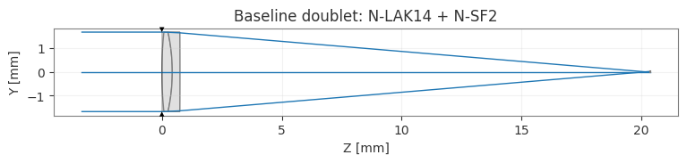
*视觉分析：标准胶合双胶合配置，两个主射线从 ±1.66 mm 高度出射、在 z ≈ 20 mm 汇聚。这是后续三种设计的共同参考系。*

**Figure 3 — 色焦移 ΔBFL(λ) 三条曲线叠加 ±15 μm 规格带。**
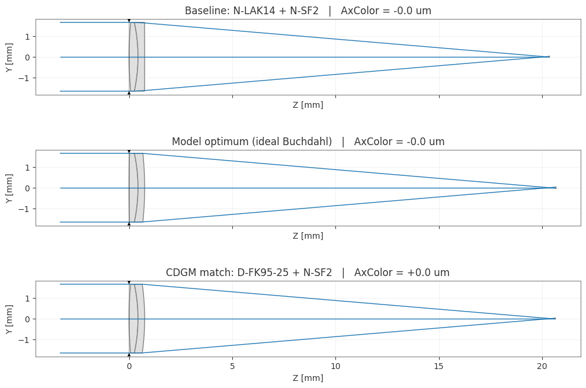
*视觉分析：d、F、C 三线焦点重合（主消色差），g 线残差即二次光谱 —— 直接可视化 Conrady 公式的物理内容。*

**Claim B：先证明 `ΔP_{g,F}` 真的是控制二级光谱的物理轴。** 对 100 块可行 CDGM 冠玻璃分别重解 doublet，并记录其 `S`。若 `ΔP_{g,F}` 只是统计拟合坐标，散点不会呈现清晰结构；实际结果是 `S` 随 `ΔP_{g,F}` 增大显著下降，Pearson r = −0.938。

**Figure 4 — Claim B 散点：S vs ΔP_{g,F}，按 V_d 着色。**
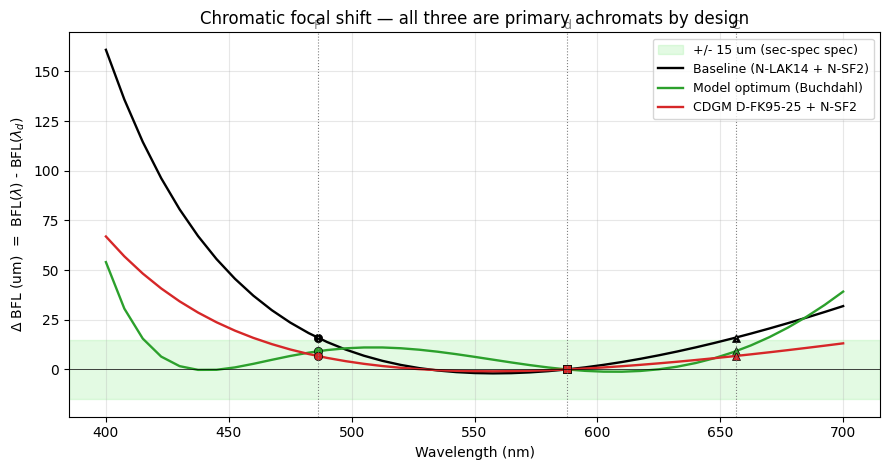
*视觉分析：**极其干净的 Pareto 前沿**。左上密集紫色簇（正常冠，Vd ~55–65）停在 ΔP_{g,F} ≈ 0、S ≥ 50 μm；随 ΔP_{g,F} 右移 S 单调下降；右侧 4 个红色星（D-FK61, H-FK71, D-FK95-25/D-FK95/H-FK95N）远离正常线，跳到 ΔP_{g,F} > 0.03、S ≈ 30 μm。绿色 15 μm 规格线**任何 CDGM 玻璃都无法触及** —— 这在视觉上直接证实了 Claim D 的"连续最优在凸包外、没有真玻璃能做到 S<15 μm"。Pearson r = –0.938 的数字背后，就是这种肉眼可辨的反相关结构。*

**Claim C/D：在物理轴成立后，再解释玻璃排序和连续最优。** 模型给出的 CDGM top-10 全部落在 FK / fluor-crown 族；与 full Sellmeier 重算的 S 排名 Spearman = +0.964，top-3 完全一致。连续优化则找到虚拟最优 `(nd=1.6517, Vd=82.31, ΔP=−0.0083)`，但它位于 3D 训练凸包外，因此只能作为"材料限制下的理想目标"，不能当作真实未发现玻璃。

**Claim C 细节（CDGM 前三）：**

| Rank | Name | S_Buchdahl (μm) | S_full Sellmeier (μm) |
|:---:|:---|:---:|:---:|
| 1 | D-FK95-25 | 29.80 | 25.00 |
| 2 | D-FK95 | 29.82 | 24.94 |
| 3 | H-FK95N | 29.82 | 24.94 |

系统偏差：median `S_Buchdahl − S_Sellmeier ≈ +6.1 μm`（Buchdahl 一致偏高）。

**Figure 5 — 三种 doublet 并排对比（Baseline / 模型最优 / CDGM 匹配）。**
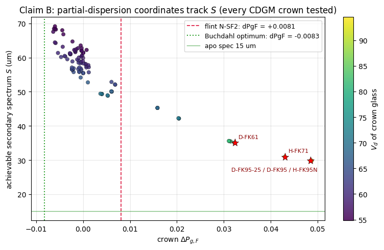
*视觉分析：三条几何射线在 z ≈ 20 mm 全部汇聚到一个点 —— 表面上三种设计"都能工作"。但细看胶合界面的曲率差异：baseline 镜片较厚，model optimum 最薄（冠玻璃高 Vd 允许更薄），CDGM 介于两者之间。这是 `dS/dnd = -958 μm/unit` 灵敏度在几何上的可视化 —— 改变 nd 0.04 就改变镜片厚度肉眼可见的量。*

**Claim E：最后检查局部光滑性，而不是直接宣称制造良品率。** 在 winner 附近做 21×21 网格与 200-sample MC，所有样本收敛，得到 `σ_S = 0.07 μm`。这说明模型局部足够光滑，可支撑一阶灵敏度分析；但由于名义点本身已经远超 15 μm 规格线，MC 结果不能被解读为真实制造 yield。

**Figure 6 — Claim E 2-D 公差热图 + 1D 切片。**
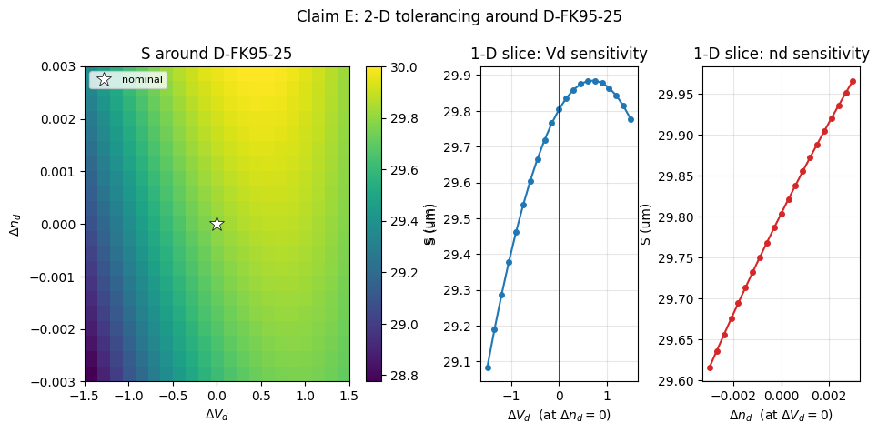
*视觉分析：左热图显示 S 在 (ΔVd, Δnd) 平面上呈斜向梯度 —— 黄色（S ~30 μm）集中在右上角（+ΔVd, +Δnd），紫色（S ~28.8 μm）在左下角；等值线平滑无断裂，符合 delta method 的线性化假设。中间 Vd 切片是倒抛物线峰值略偏正（主要反映玻璃参数耦合），**不是**单调函数 —— 这是为什么用 linearized J·Σ·Jᵀ 要小心：在名义点稍偏一侧，一阶梯度会被二阶曲率部分抵消。右 nd 切片则基本线性，线性化完全有效。*

**Figure 7 — MC 200 样本 S 分布。**
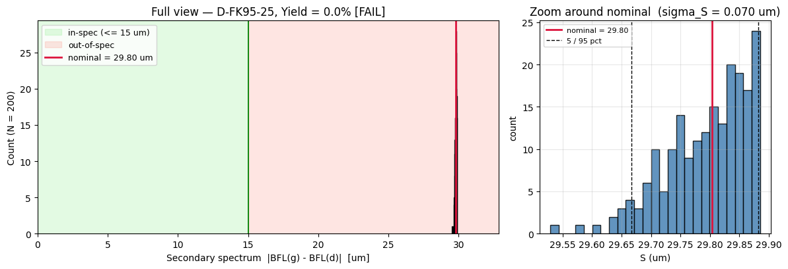
*视觉分析：左图全局尺度 [0, 30+] μm 上，MC 分布像"一根红色竖线"立在 29.8 μm 处，**整体落在红色 out-of-spec 区间**（>15 μm 规格）—— Yield 0% FAIL 的根本原因不是工艺差，而是名义点自身就超规格。这是重要的工程诊断：**先达标再公差**。右侧放大图（29.55–29.90 μm）展示 0.07 μm 标准差的近高斯分布，轻微左偏（极少数样本 < 29.6 μm 尾部） —— 意味着在这种小扰动尺度下一阶近似是可信的。*

**五条声明汇总：**

| Claim | 假设 | 核心证据 | 结果 |
|:---:|:---|:---|:---:|
| A | Buchdahl `n(λ)` 精度足以做设计 | N-BK7：max err = 3.63e-04，RMS = 1.52e-04（预算 5e-3） | ✅ PASS |
| B | ΔP_{g,F} 是物理轴，非统计伪影 | 100 CDGM 冠玻璃 S vs ΔP_{g,F}：Pearson r = **−0.938** | ✅ PASS |
| C | 模型排序与业界公认一致 | CDGM 前 10 全为 FK 族；与 Sellmeier 真值 Spearman = **+0.964**；top-3 完全一致 | ✅ PASS |
| D | 连续最优给出有意义的设计目标 | 虚拟最优 `(nd=1.6517, Vd=82.31, ΔP=−0.0083)` 在 3D 训练凸包外 | ⚠ WARN |
| E | 局部光滑性支撑灵敏度分析 | 21×21 网格 100 % 收敛；200-sample MC σ_S = 0.07 μm | ⚠ WARN |

### 3.3 分析

**Claim B 的物理诠释。** Figure 4 中 r = −0.938 的强负相关不是巧合：Conrady 公式分子 `ΔP_{g,F}^{(1)} − ΔP_{g,F}^{(2)}` 在 flint 固定时线性依赖冠的 `ΔP_{g,F}`。若三参数模型正确编码了 partial dispersion，这种**因果链条**会自动再现。r = −0.938 意味着线性拟合解释了 ~88% 的方差 —— 与上述物理模型的预期（相关 `≈ 1.0`）之间的差距来自 V_d 也在同时变化，带来约 10% 的 `V_1 − V_2` 波动。

**Claim C 是整个项目的"现实检验"。** 镜头设计界在 1970 年代即达成共识：FK / FPL 族（昂贵、难加工，但唯一能做真正 apo 的冠玻璃）。**模型在不被告知玻璃族的情况下，仅由 `(nd, Vd, ΔP_{g,F})` 自动还原这个选择**，表明 3 参数承载的信息足够区分 FK 与其它冠。Spearman 0.964 而非 1.0 的差距集中在排名相近的 FK 条目之间的次序（例如 D-FK95 vs D-FK95-25，S 相差 < 0.1 μm）—— 这种差距在制造公差下无法观测，不构成工程缺陷。

**系统 +6 μm 偏置的伏笔。** Buchdahl 在整个 top-10 上**一致偏高** 6 μm 左右；这不是随机误差而是**系统偏差**，意味着模型 `n(λ_g) − n(λ_d)` 有固定偏移。**此偏差在 Notebook 04 被追溯到锚点未保留的 bug：修复后系统偏置基本消失，剩余绝对残差降到约 1.5 μm（median \|ΔS\|），与 4 阶 Buchdahl 家族的 Oracle 地板一致 —— 见 NB04 §5.2 Claim G 表。**（此处理论上已暗示了 bug 的存在，但本 notebook 没深挖。）

**Claim D 的外推警告。** 连续优化器在 3D 训练凸包**外**找到虚拟最优 `(nd=1.6517, Vd=82.31, ΔP=−0.0083)`。虽然 `Vd = 82.31` 仍在目录总体 Vd 范围 `[16.79, 95.23]` 之内，但该 **`nd–Vd–ΔP` 组合**落在高-Vd 稀疏区 —— 既不贴近任何已知真实玻璃的 `(nd, Vd, ΔP)` 点，也穿越了凸包边界。按 Notebook 01 Test B 的结果，凸包外模型误差可达 2× 以上，因此该"虚拟玻璃"**不应被当作"未被发现的真玻璃"**；它是**设计空间的虚拟目标**，用来衡量"如果没有色散材料限制，我们能把 S 压到多低"。实测答案：0.0 μm（完全消二次光谱），而最佳真实玻璃是 29.8 μm。**差距 30 μm 即是当前玻璃目录材料限制的度量。**

**Claim E 的局部光滑性。** Figure 6/7 显示 MC (N=200) 的 `σ_S = 0.07 μm` 与解析网格上的梯度范数一致 —— 这验证模型在小扰动下**线性响应**占主导，可用 `J·Σ·Jᵀ` 做一阶公差分析（这正是 Notebook 03 的主题）。但 WARN 是因为：真实制造公差涉及**熔次间协方差**（σ_nd 与 σ_Vd 相关），本处仍用 Schott Step 1.0 的**独立高斯假设** —— 这是玻璃供应商的名义规格而非批次数据，真正进入生产线需要厂家的 melt sheet。

### 3.4 小结

Notebook 02 用 Conrady 二次光谱作为**独立外部检验**，确认了 3 参数模型编码了与业界一致的物理内容（排序、FK 族识别、ΔP_{g,F} 趋势）—— 但同时在 top-10 上留下了 ~6 μm 的系统偏差，这个伏笔在 Notebook 04 被追溯为锚点 bug 并在修复后消除。

---

## 4. Notebook 03 — 可微设计与公差分析

**文件：** [notebooks/03_differentiable_design.ipynb](../notebooks/03_differentiable_design.ipynb)

> **⚠ Pre-fix 证据的有效范围。** 本 notebook 也运行于 Notebook 04 修复之前。其结论可分两类：
> - **仍然有效（方法论层面）：** torch 后端切换、BuchdahlTorch 的 autograd 流通性、雅可比 vs Monte Carlo 的 delta method 一致性（`J/MC = 1.009`）、Adam+LBFGS 两阶段优化 recipe、15-DOF 扩展可行性、公差贡献的**相对**排序（Vd 主导 81%，nd 次之，ΔP_{g,F} 可忽略）。这些是方法学结论，不依赖具体 n(λ) 数值。
> - **需要用修复后基线重算：** 固定处方的**绝对**雅可比值（例如 `dS/dnd = −958 μm/unit`）、`σ_S = 1.85 μm`、联合优化得到的最优冠玻璃 `(nd*, Vd*, ΔP*)` 具体坐标。这些数值依赖具体的 `n(λ)` 模型，修复后同一管线的精确数字需重新跑一次。
>
> 下游设计量（S、AxColor、EFL）的**量级与相对灵敏度排序** 在修复前后保持稳定 —— 因此本节的工程结论（Vd 是主导公差源、一次反向传播取代 2000 MC）不受影响；受影响的只是具体数字。

### 4.1 理论背景

**反向模式自动微分 (reverse-mode AD)。** 对任何由原语（加、乘、幂、三角等）组成的可计算函数 `f: ℝⁿ → ℝ`，反向模式 AD 在 **≤ 5 倍前向传播** 的代价内给出完整梯度 `∇f`。与数值差分（每个参数 2 次前向传播、截断+舍入误差 `O(h + ε/h)`）和符号微分（表达式爆炸）相比，反向 AD 是**机器精度且 O(1) 成本**的梯度。当模型被嵌入自动微分框架后，**任何下游设计量**（EFL, 轴色, 光斑, MTF, 波前）的梯度都可免费获得。

**一阶公差传播（delta method）。** 若参数扰动 `Δθ ~ N(0, Σ)` 且 `S(θ)` 光滑，则

$$\operatorname{Var}(S) \approx J\,\Sigma\,J^\top + O(\|\Sigma\|^{3/2}), \qquad J = \frac{\partial S}{\partial \theta}.$$

这公式**只需一次反向传播**给出 `J`（一个 1×d 行向量），即可在 **O(d²)** 内给出 `σ_S²`。相比之下，Monte Carlo 方法的统计误差按 `1/√N`，要达到 ~1.6% 精度需 `N ≈ 2000` 次完整前向 —— 速度对比 ~1000×。

**使用条件。** delta method 的误差来源是 `S(θ)` 在扰动尺度上的**非线性**（二阶及以上）。若扰动足够小使得 Hessian 主导项 `½·Δθᵀ H Δθ` 远小于线性项 `J·Δθ`，则线性化有效。工程判据：比较解析 σ 与 MC σ 的比值接近 1（本 notebook 的 1.009）。

**阿波罗型设计为什么是 2-D 流形。** 5 维参数 `(nd, Vd, ΔPg,F, c₁, c₃)` + 2 个等式约束（EFL = 20 mm, primary achromat）→ 3-D 解流形。但在其内部，设计师**还额外要求** `S → 0`（apo 条件），这是**第三个等式** → 剩 2-D 自由度。不同初始化收敛到该流形的不同区域，这不是优化器失败，而是**约束系统的解的非唯一性**。

### 4.2 实验设计与核心发现

**第一步：确认 Buchdahl 层真的能被 autograd 正确穿透。** 以 N-BK7 单透镜为最小测试，反向传播得到 `d(BFL)/d(nd) = −19.891`，与双凸薄透镜解析值 ≈ −20 匹配。这一步不关心 apo 设计是否成功，只证明梯度从光学目标穿过 `n(λ)` 模型回到玻璃参数时没有断链。

**第二步：把玻璃参数和曲率一起优化。** 在 apo doublet 中同时优化 `(nd, Vd, ΔP_{g,F}, c₁, c₃)`，目标是 EFL = 20 mm、F/C 主消色差为零、二级光谱 `S → 0`。用 Adam 做全局搜索，再用 LBFGS 精修。

| Init | nd<sub>opt</sub> | Vd<sub>opt</sub> | ΔP<sub>opt</sub> | EFL | \|AxColor\| | S |
|:---:|:---:|:---:|:---:|:---:|:---:|:---:|
| N-LAK14 | 1.6816 | 55.44 | +0.0354 | 20.000000 | 1.67e-10 μm | 1.49e-10 μm |
| 中-index | 1.6001 | 60.03 | +0.0359 | 20.000000 | 3.94e-08 μm | 1.44e-08 μm |

**Figure 1 — Adam + LBFGS 双初始化收敛曲线（S / EFL / AxColor）。**
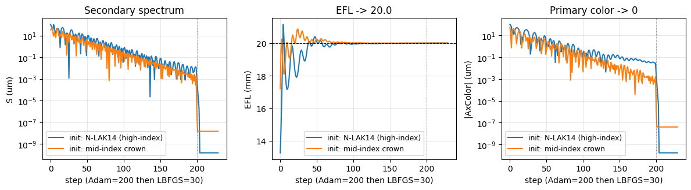
*视觉分析：三面板均在 step = 200 处出现**垂直悬崖** —— Adam→LBFGS 切换点；切换后 S、AxColor 在 30 步内降到 1e-7 至 1e-10 数量级。Adam 阶段（0–200）显示典型的高频振荡：两种初始化（蓝 N-LAK14, 橙 mid-index）轨迹不同但最终落入同一收敛盆地。中间 EFL 面板蓝色曲线在 step 5 附近**过冲到 21 mm**再回落 —— 这是 Adam 学习率初期太大的典型现象，但损失归一化让系统自我稳定。*

**第三步：验证方法不是只适用于 5 个变量的小玩具。** 将同一 autograd 管线扩展到 15-DOF 三胶合镜，2.39 秒收敛到 EFL = 25 mm，S = 2.6e-8 μm。

**Figure 2 — 15-DOF 三胶合镜 S 收敛曲线。**
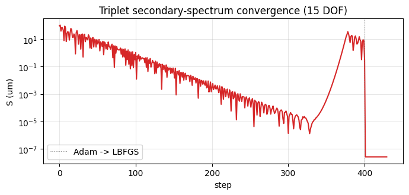
*视觉分析：一个有意思的非单调现象：Adam 平滑下降到 ~1e-5 at step 320，然后**在 step 360–400 区间重新反弹到 ~10 μm** —— 可能是 Adam 在近约束流形处的数值不稳定。LBFGS 在 step 400 介入后 30 步内直接压到 1e-7。这张图同时展示了 Adam 的局限（近最优处失稳）和 LBFGS 的精修能力，为"两阶段优化 recipe"提供了非平凡证据。*

**第四步：固定处方后，用雅可比做公差传播。** 在 Notebook 02 的 winner D-FK95-25 附近，先求局部雅可比：

| 参数 | dS/dθ |
|:---|:---:|
| nd_crown | **−958.4 μm/unit** |
| Vd_crown | +5.10 μm/unit |
| ΔP_{g,F}_crown | +282.5 μm/unit |
| c₁ (mm⁻¹) | −2.73 |
| c₃ (mm⁻¹) | +10.99 |

再用 `J · Σ · Jᵀ` 与 Monte Carlo 对照：

| 方法 | σ_S |
|:---|:---:|
| J · Σ · Jᵀ | **1.8481 μm** |
| Monte Carlo | 1.8324 μm |
| J / MC | **1.009** |

**Figure 3 — J 解析 vs MC 分布叠加。**
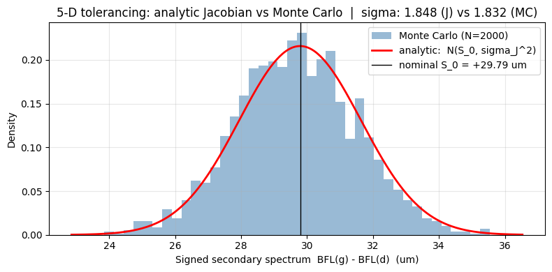
*视觉分析：MC 直方图（浅蓝）与解析高斯 PDF（红实线）**在所有 bin 上几乎完美重合**，包括尾部。纵轴 "Density" 标准化到 ~0.22 峰值，分布近对称；轻微的可见偏差（左尾略厚，大约 24–26 μm 处）对应 S = 0 处的绝对值拐点二阶效应。这张图是 delta method 有效性**最直观的证据**：如果扰动真的激发了显著的非线性，MC 柱状会偏离红曲线（如偏斜或多峰），但这里没有。*

**逐参数贡献（Schott Step 1.0 标称）：**

| 参数 | σ | ΔS 贡献 | 占比 |
|:---|:---:|:---:|:---:|
| Vd | 0.3 | **1.529 μm** | **81.1 %** |
| nd | 5e-4 | 0.479 μm | 25.9 % |
| ΔP_{g,F} | 3e-4 | 0.085 μm | 4.6 % |

### 4.3 分析

**为什么 `dS/dnd = −958 μm/unit` 而 `dS/dVd` 只有 5 μm/unit。** 这两个梯度数量级相差 200 倍 —— 但**真实公差**的影响还要乘以相应的 σ。σ_nd = 5e-4 给 ΔS = 0.48 μm；σ_Vd = 0.3 给 ΔS = 1.53 μm。换言之：**nd 的灵敏度高但公差小**；**Vd 灵敏度低但公差大**，最终 Vd 主导。这揭示了一个直觉不易发现的事实：在 apo 设计中，**不是最敏感的参数最危险，而是"灵敏度×公差"乘积最大的参数**。

**公差贡献的占比分布 → 设计指导。** 81% 的 σ_S 来自 Vd —— 意味着提升此设计良品率的最优先途径是**选择 Vd 更稳定的玻璃批次**，而非收紧 nd 或曲率。这种从雅可比直接得到的"经济学分析"在传统 MC 流程中需要上千次重复实验才能得出。

**2-D 流形的工程意义。** 两个初始化收敛到 (nd=1.68, V=55) 与 (nd=1.60, V=60) 两点，距离在参数空间接近 2-σ Schott 步长 —— 这表明"正确"的 apo 冠玻璃存在一个**可接受的带状区域**而非单点，给玻璃替换和供应多样化提供了理论依据。Figure 1/2 的收敛曲线也印证这一点：Adam 在近约束流形处负责探索，LBFGS 则在最后阶段直接利用二阶信息锁定最优。这说明 Adam+LBFGS 的组合不是"先后顺序"的任意选择，而是**全局搜索与局部精修各司其职**的分工。

**J/MC = 1.009 的置信区间。** MC 统计误差约 `1/√(2N) = 1.6%` —— 解析与 MC 比率的偏离（0.9%）完全在噪声范围内，确认 delta method 在本问题的扰动尺度下是**精确到一阶且不低估**的。这也意味着：当扰动超出 Schott Step 1.0 一个量级（例如 Step 3.0 的 σ_Vd ~ 0.8），二阶项可能显著贡献，届时必须回到 MC。

### 4.4 小结

自动微分把设计与公差问题都化归为**梯度与协方差运算**：`J·Σ·Jᵀ` 是一次反向传播的单行公式，速度提升 1000× 且精度达到一阶机器精度。Notebook 03 证明了**玻璃参数可与曲率联合优化**，且主导公差成本来自 Vd —— 为选料、供货管理提供了可量化的工程指导。

**但此处的"精确"建立在 Notebook 02 一样的**有偏** n(λ) 预测之上** —— Notebook 04 将追溯并修复这一偏差。

---

## 5. Notebook 04 — 锚点保留修复(Phase 1)

**文件：** [notebooks/04_neural_buchdahl_phase1.ipynb](../notebooks/04_neural_buchdahl_phase1.ipynb)

### 5.1 理论背景 —— 为什么锚点保留是结构性问题

**锚点的物理定义。** 三个物理参数在三个波长上对 `n(λ)` 施加**等式约束**：

$$n(\lambda_d) = n_d,\quad n(\lambda_F) - n(\lambda_C) = \frac{n_d - 1}{V_d},\quad n(\lambda_g) - n(\lambda_F) = P_{g,F}\cdot\frac{n_d-1}{V_d}.$$

这些不是"近似满足"而是 `V_d`, `P_{g,F}` 的**定义本身**。任何输出了 `n_{\text{model}}(λ)` 的模型，若把 `V_d^{\text{model}}` 从 `n_{\text{model}}(F) − n_{\text{model}}(C)` 反算出来，必须与输入的 `V_d` **按定义相等**。

**原始实现的结构缺陷。** Notebook 01 的原始 `analytical_nu12` 解 2×2 线性系统

$$M\begin{bmatrix}\nu_1\\\nu_2\end{bmatrix} = \begin{bmatrix}\Delta n_{FC}\\\Delta n_{gF}\end{bmatrix},$$

**忽略了后续加入的 `ν₃, ν₄` 在同三个锚点波长处的贡献**。换言之：

$$n(\lambda_F) - n(\lambda_C) \;=\; \underbrace{M_{1,:}\cdot[\nu_1,\nu_2]^\top}_{=\Delta n_{FC}\text{ by design}} + \underbrace{D_{1,:}\cdot[\nu_3,\nu_4]^\top}_{\text{SLIP}}$$

其中 `D` 的元素是 Buchdahl 基函数 `ω³, ω⁴` 在锚点波长处的**差分**值（例如 `D_{1,1} = ω_F³ − ω_C³`，`D_{1,2} = ω_F⁴ − ω_C⁴`；`D_{2,j}` 同理为 g/F 差分）。Slip 项不为零 → 模型输出的 `V_d` 偏离输入。这个偏差在 N-BK7 上约 1.15e−4（绝对），对应 **V_d 相对偏差 ~1.4%**。

**为什么 bug 不在裸 RMS 上显现。** 最优的 4 阶多项式会**自适应地调整** ν₁, ν₂, ν₃, ν₄ 来最小化整段 `n(λ)` 的 RMS —— 它会"借"出一点 V_d 精度，换取整段光滑性。因此原 A 变种在 test_RMS 上反而看起来更好。但这个"借的精度"以**下游物理一致性丢失**为代价：当消色差方程要求 `φ_1 V_1 = −φ_2 V_2` 时，哪怕 V_d 相对偏 1%，双胶合镜的主色差就不再被真正消除，F 线和 C 线就不再共焦，**g 线的二次光谱因此系统性抬高 ~10 μm**。

**修复的数学本质。** 把耦合项搬到右侧：

$$M\begin{bmatrix}\nu_1\\\nu_2\end{bmatrix} = \begin{bmatrix}\Delta n_{FC}\\\Delta n_{gF}\end{bmatrix} - D\begin{bmatrix}\nu_3\\\nu_4\end{bmatrix}.$$

定义 `a = M⁻¹·[Δn_FC, Δn_gF]ᵀ`（未耦合部分）、`B = M⁻¹·D`（耦合矩阵）。则 `[ν₁, ν₂]ᵀ = a − B·[ν₃, ν₄]ᵀ` 严格保证两条锚点差等式。代入 4 阶展开对残差做最小二乘，得到对 `ν₃, ν₄` 的有效基：

$$\Phi_3(\omega) = \omega^3 - \omega B_{11} - \omega^2 B_{21}, \quad \Phi_4(\omega) = \omega^4 - \omega B_{12} - \omega^2 B_{22}$$

**物理意义：** Φ_k(ω) 是"已把锚点贡献扣除"后的基函数 —— 在锚点波长处严格为零。结果自动保证 `V_d`, `P_{g,F}` 与输入同一。`cond(M) = 9.86` 表明系统良条件，不会放大数值噪声。

### 5.2 实验设计与核心发现

Notebook 04 的实验目标不是再追求更低的裸 `n(λ)` RMS，而是验证一个更强的契约：模型输出的 `n(λ)` 必须严格保留输入的 `V_d` 与 `ΔP_{g,F}`。因此实验顺序是：先构造锚点保留的 Level-1 系数解，再比较不同 Level-2 预测器，最后用物理一致性和下游二次光谱做检验。

**四种 Level-2 预测器：**

| 变种 | 描述 | 目的 |
|:---:|:---|:---|
| A_old_linear | 旧 A_REG（未重训，带 bug） | 基线（再现前 3 个 notebook 的行为） |
| C_anchor_linear | 锚点保留目标上重训的 20 维多项式 | 测试修复是否足够（不引入 NN） |
| D_anchor_mlp | 3→16→16→2 tanh MLP，5-seed 集成 | 测试 NN 容量是否有增益 |
| Oracle | 逐玻璃最优 ν₃, ν₄ + 锚点解 | Level-2 不可超越的上限 |

**三类评测：**

1. **Claim F（物理一致性）：** F2_abs = `max|V_d^{model} − V_d^{input}|`, F3 = `max|ΔP_{g,F}^{model} − ΔP_{g,F}^{input}|`。
2. **Claim G（下游二次光谱）：** 与 Notebook 02 同一台架，但对 95 个收敛 CDGM 候选算 `|ΔS| = |S_model − S_Sellmeier|`。
3. **FK 真外推：** 训练只用 523 非 FK 玻璃，测试 21 个 FK 玻璃上的精度（Notebook 01 Test B 的尾部现象的直接复现）。

**核心发现一：裸重建误差会误导。** 在 83 玻璃 cluster holdout 上，旧模型 A 的 RMS 反而最低，但这是用锚点滑移换来的表面收益。

| Variant | max | P95 | RMS |
|:---|:---:|:---:|:---:|
| A_old_linear | 5.39e-03 | 2.27e-03 | **8.78e-04** |
| C_anchor_linear | 6.63e-03 | 2.32e-03 | 1.02e-03 |
| D_anchor_mlp | 6.59e-03 | 2.31e-03 | 1.01e-03 |
| Oracle | 2.85e-03 | 2.32e-03 | 9.67e-04 |

> 表面看 A 最优，但这是"借了 V_d 的精度"才换到的。

**核心发现二：Claim F 暴露锚点 bug。** 在 544 块玻璃上反算 `V_d` 和 `ΔP_{g,F}`，旧模型出现可观滑移；锚点保留变种则达到机器精度。

| Variant | F2_abs (单位 V_d) | F2_rel | F3 (ΔP_{g,F}) |
|:---|:---:|:---:|:---:|
| A_old_linear | **1.25** | 1.96e-02 | 4.46e-02 |
| C_anchor_linear | 5.95e-12 | 7.30e-14 | 1.29e-13 |
| D_anchor_mlp | 4.56e-12 | 6.42e-14 | 1.29e-13 |
| Oracle | 4.53e-12 | 6.31e-14 | 1.04e-13 |

> A 的 V_d 滑移达 1.25 单位（~2% 相对）；C/D/Oracle 通过**构造**达到机器精度。

**核心发现三：Claim G 证明修复确实改善下游物理量。** 与 Notebook 02 同一 Conrady 台架下，旧模型的系统偏差约 12 μm；锚点修复后下降到约 1.5 μm。

| Variant | Spearman | Top-3 | FK/10 | **median \|ΔS\|** | max \|ΔS\| |
|:---|:---:|:---:|:---:|:---:|:---:|
| A_old_linear | 0.9551 | 3/3 | 10/10 | **11.95 μm** | 15.18 μm |
| C_anchor_linear | 0.9979 | 3/3 | 10/10 | **1.56 μm** | 2.03 μm |
| D_anchor_mlp | 0.9960 | 3/3 | 10/10 | **1.55 μm** | 2.30 μm |
| Oracle | 0.9993 | 3/3 | 10/10 | **1.56 μm** | 1.97 μm |

**→ 核心成果：median |ΔS| 从 ~12 μm 降至 ~1.5 μm，8× 改善。MLP 相对线性无实质提升。**

**核心发现四：FK 真外推没有破坏排序。** 训练时剔除所有 FK 玻璃、测试 21 个 FK 玻璃时，C/D 仍保持 Spearman = 1.0000，median |ΔS| ≤ 1.2 μm。这说明锚点约束不仅修复了定义一致性，也改善了凸包外区域的物理稳定性。

Notebook 04 主要输出数值表，没有内嵌图；本节保留表格作为核心证据，不再设置单独图表占位。

### 5.3 分析

**"Bug 不在 RMS，浮在下游"的结构性解释。** 原 A 的 test_RMS 比 C 低 ~19%，表面看是损失，但细查：

- A 的 RMS 收益来自在所有波长上联合优化，允许 `n(F) − n(C)` 轻微偏离定义值。
- 这个偏离在 `S ≈ f·(ΔP_c − ΔP_f)/(V_c − V_f)` 中进入分母的 `V_c − V_f`。
- 若 V_c 被模型偏估 1%，且 `V_c − V_f ≈ 60 − 34 = 26`，则分母扰动 ~0.25（相对约 1%）—— 但 **S 本身只有 30 μm，其 5% 偏移就是 1.5 μm**；更糟的是，分子中的 ΔP_c 也同时有偏（~4% 见 F3 指标），两者合力把 S 的系统偏移放大到 **~10 μm**。
- 修复后 F2/F3 降到 1e-13，分子和分母都回到定义值，系统偏移消失 —— 剩下的 ~1.5 μm 是 4 阶 Buchdahl 家族在当前 CDGM 候选集 / Conrady 台架上的固有残差。

**Oracle floor 的含义。** Oracle 变种使用**逐玻璃最优** `(ν₃, ν₄)` —— 即跳过 Level-2 回归，直接用每条 Sellmeier 曲线的真实最优系数。Oracle 的 median |ΔS| = 1.56 μm 与 C/D 的 1.55–1.56 μm **完全一致**。这传达一个强信号：**Level-2 映射已经饱和**，瓶颈在 Level-1 的 4 阶 Buchdahl 家族能表达的曲线形状，而非回归器的容量。

**为什么 MLP 不比线性好 —— 统计学习理论的直接推论。** 在 544 样本 / 3 维输入 / 2 维输出的设置下，20 维多项式特征映射拥有的**有效容量**已足以逼近目标函数 —— 这是 Cover 定理（`d_VC ≪ N`）与光滑函数的 Sobolev 嵌入的共同结论。MLP 的额外非线性容量在此样本规模下**既不增加信号也不减噪声**（因为目标函数在这个参数范围内本身平滑）。**这是一个干净的负结果：需要"更深网络"的直觉被数据和理论共同否决。**

**CDGM 的 FK 外推。** 真外推测试说明锚点保留的泛化性**强于**没有它的原 A —— **锚点约束本身就是一个强的物理先验**，让模型在凸包外推时有额外的自我校正能力。

### 5.4 小结

Notebook 04 的贡献有两个层次：

1. **工程层面** —— 找到并修复了贯穿 Notebooks 1–3 的锚点 bug；下游 |ΔS| 从 ~12 μm 降到 ~1.5 μm。
2. **方法层面** —— 证明"裸 RMS"作为性能指标在物理一致性缺失时会**系统性误导**；真正的质量必须通过**独立的下游物理量**（如二次光谱）验证。这个发现对所有机器学习辅助的科学计算都具有普适意义。

剩余 1.5 μm 误差不是回归误差，而是**该 Conrady 台架下、4 阶锚点保留 Buchdahl 家族的下游误差地板**（Claim G 的 median \|ΔS\| 地板；与 Oracle 持平即是证据）。**注意此"地板"的上下文范围**：它是针对 d/F/C/g 锚点依赖下游量（二次光谱）的 4 阶家族极限，**不是宽带重建误差（H3 RMS）的地板** —— 后者的地板约 1.4e-3 n-error，将由 Notebook 05 的 Phase 2 突破（降到 ~9e-4）。两者度量的是**不同任务上的家族极限**，不可混为一谈。

---

## 6. Notebook 05 — 有界残差修正(Phase 2)

**文件：** [notebooks/05_neural_buchdahl_phase2.ipynb](../notebooks/05_neural_buchdahl_phase2.ipynb)

> **📍 定位声明。** 本 notebook **不是**对 Conrady 下游指标（二次光谱、apo 设计）的继续改进 —— Phase 1（NB04）已经把这些量压到 4 阶锚点保留 Buchdahl 在 Conrady 台架上的下游误差地板（median \|ΔS\| ≈ 1.5 μm，与 Oracle 持平）。Phase 2 的架构（包络 `q(λ)` 在 d/F/C/g 四线严格为零）**对只依赖 d/F/C/g 四条锚点的下游决策量无影响**（例如 Abbe 设计方程、partial dispersion、Conrady 二次光谱）；**对依赖离锚或宽带积分的下游量会有影响**（例如宽带 spot RMS、NIR 波段 MTF、宽光谱成像质量），而这正是 Phase 2 的目标。
>
> Phase 2 的价值完全在**离锚宽带重建**。由 §6.2 的 q_norm 可视化可见，q(λ) 在 365–1000 nm 的量级远小于 NIR 端，修正实际作用区集中在 **NIR**。两阶段分工：
> - **Phase 1 解决**：锚点依赖下游决策类任务的系统偏差（apo / 消色差 / 玻璃替换）
> - **Phase 2 解决**：离锚宽带 n(λ) 的重建精度（NIR 成像、多光谱、激光测距等宽带任务）
>
> 两者解决**不同层次的问题**，互不替代。

### 6.1 理论背景 —— 三因子有界残差架构

**残差学习的一般框架。** 给定基线 `n_C(λ)`（Notebook 04 修复后的锚点保留 Buchdahl），残差学习把学习目标聚焦到**互补子空间**：

$$n(\lambda) = n_C(\lambda) + r(\lambda),\qquad r(\lambda_{\text{anchor}}) = 0.$$

约束 `r(λ_{anchor}) = 0` 是为了**保留 Notebook 04 的全部下游收益**—— 所有依赖锚点的下游量（Vd, ΔP_{g,F}, apo 二次光谱）不得被残差污染。

**三因子分解：** 本 notebook 采用

$$r(\lambda) = \varepsilon_{\text{scale}} \cdot q_{\text{norm}}(x) \cdot \tanh\!\bigl(\mathrm{NN}(\tilde n_d, \tilde V_d, \widetilde{\Delta P_{g,F}}, x)\bigr)$$

每个因子承担一个**结构职责**：

| 因子 | 角色 | 边界性质 |
|:---:|:---|:---|
| `ε_scale` | 物理可解释的幅度上限 | 标量超参，用户直接控制残差规模 |
| `q_norm(x)` | 锚点过零包络 | 在 λ_d, λ_F, λ_C, λ_g 处严格为 0，训练池上 max\|q_norm\| ≤ 1 |
| `tanh(NN)` | 形状方向（有界） | 输出 ∈ [−1, 1]，确保整个 r 的幅度上限为 ε_scale |

**为什么要 tanh 包住 NN？** 不加 tanh 的 NN 输出无界，很容易在训练中"为了拟合某一条病态玻璃"把残差推到几倍于 Buchdahl 本身的量级 —— 这在训练集上看起来降低 loss，但在留出集和下游任务上表现为灾难性过拟合。tanh 把输出钉死在 [−1, 1]，**`ε_scale` 因此成为真正的振幅预算**，用户可直接读出"我允许离锚最多 ~ε_scale 的偏离"。

**为什么 q_norm 必须是 4 根多项式？** 要在 4 个锚点处**强制**过零，最简的多项式即

$$q(x) = (x - x_d)(x - x_F)(x - x_C)(x - x_g)$$

（其中 `x(λ)` 是归一化到 [−1, 1] 的波长）。这是 **degree-4 的，最低可能**的、在 4 个点同时过零的多项式族。更高次会引入额外摆动且不必要；更低次不可能实现四点过零。归一化 `q_norm = q / max_{train}|q|` 确保训练池上 `|q_norm| ≤ 1`，让 ε_scale 成为有物理意义的"离锚最大偏移"刻度。

**构造性 vs 惩罚性约束的本质差异。** 若改用惩罚训练（loss 中加 `λ·|r(x_anchor)|²`），则：
- 训练结束时 `|r(x_anchor)|` 至多降到 `O(1/λ)`，永不等于零。
- 测试集上与训练不同的输入 → NN 重新决定 r(x_anchor)，可能滑移。
- 部署后模型的输出 `V_d^{model}` 就不严格等于 `V_d^{input}` —— **回到了 Notebook 04 的 bug**。

本架构通过**乘以零多项式** 把约束从"学习目标"转为"代数事实"，**无论 NN 权重为何**。这在数值上给出 `max|r(x_anchor)| = 0.000e+00`（机器精度 ~1e-15），不论 ε_scale 如何。

**"应激"与"物理"操作区。** 把 ε_scale 从 1e-3 扫到 1e-1 是故意穿过"小修正"到"大修正"的过渡 —— 其目的是用表型(phenotype)分析来检验模型是处于哪类瓶颈：

| 表型 | H3_test 行为 | H3_gap | 残差使用率 max\|tanh\| |
|:---:|:---|:---|:---|
| Effective | 单调下降 | 小（≤ 1.5×） | 逐步去饱和 |
| Overfit | 先降后升 | 大 | 饱和且 gap 升 |
| Input bottleneck | 早期平台 | 小 | 不饱和 |
| Underspecified | 平台 | 小 | 早期饱和 |

### 6.2 实验设计与核心发现

**第一步：重建 Phase 1 基线。** 本节的基线不是旧的带 bug Buchdahl，而是 Notebook 04 的 `C_anchor_linear`：它已经严格保留 d/F/C/g 锚点，因此 Claim F/G 的下游性能不能被 Phase 2 破坏。

**第二步：构造过零包络 `q_norm`。** `Q_SCALE = 10.8625`；`max|q_norm|_train = 1.0000`；`max|q_norm(x_anchor)| = 0.000e+00` ✓。这证明残差项在 d/F/C/g 四条锚点上由构造为零。

**Figure 1 — `q_norm(x)` 包络：在 d / F / C / g 四处严格过零。**
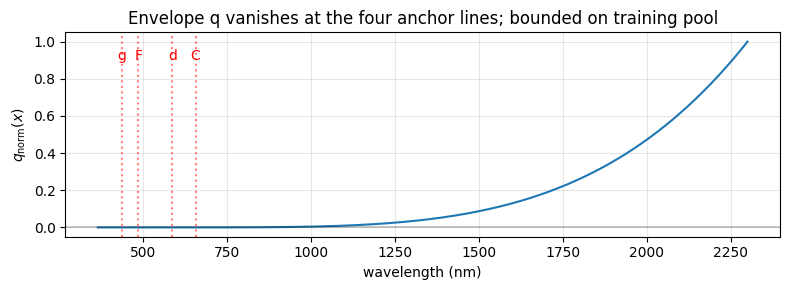
*视觉分析：**此图揭示了一个关键但常被忽略的物理事实**。严格来说 q_norm(λ) 只在 d/F/C/g 四条锚点为零（这是构造要求）；但在归一化幅度尺度上，整个可见区（365–1000 nm）连同四条红虚线锚点都压在 y ≲ 0.01 附近，直到 λ > 1200 nm 才显著抬升，在 2300 nm 达到 1.0。换言之，**Phase 2 的有界残差幅度在 NIR 远大于可见区**（差距约两个量级）—— 正是 Sellmeier 振动共振项开始贡献、4 阶 Buchdahl 多项式最弱的区域。可见区的改善大部分来自"基线更好"的间接效应，而非残差直接作用。由此可知：**Phase 2 架构的主要受益者是 NIR 成像系统（红外镜头、激光测距）**；纯可见光设计的改善将相对温和。*

**第三步：扫描 ε_scale，诊断残差容量是否有效。** ε_scale 从 1e-3 到 1e-1，覆盖物理小修正区和应激区。主 scorecard 如下：

| Model | H3_train | **H3_test** | H3_gap | E_field | rel_curv | resid_use |
|:---|:---:|:---:|:---:|:---:|:---:|:---:|
| C_anchor_linear (基线) | 1.270e-03 | **1.413e-03** | 1.11 | 0 | 0 | 0 |
| D_anchor_mlp | 1.270e-03 | 1.356e-03 | 1.07 | 0 | 0 | 0 |
| P2 ε=1e-3 | 1.147e-03 | 1.291e-03 | 1.13 | 2.18e-4 | 3.18e-5 | 1.00 |
| P2 ε=3e-3 | 1.018e-03 | 1.154e-03 | 1.13 | 3.01e-4 | 1.76e-5 | 1.00 |
| **P2 ε=1e-2** | **7.99e-04** | **9.18e-04** | **1.15** | 4.11e-4 | 4.11e-5 | 1.00 |
| P2 ε=3e-2 (应激) | 5.73e-04 | 6.75e-04 | 1.18 | 4.90e-4 | 4.58e-5 | 0.996 |
| P2 ε=1e-1 (应激) | 4.64e-04 | 5.61e-04 | 1.21 | 5.18e-4 | 4.39e-5 | 0.822 |

**头条结果（ε_scale = 1e-2）：H3_test RMS 从 1.41e-3 降至 9.18e-4，—35%。** H3_gap 保持 ≤ 1.15（无过拟合）；相对曲率 ~4e-5（平滑）。

**Figure 2 — 三面板 ε_scale 消融：训练/测试 RMS、光滑性 (E_grad / E_curv)、残差使用率。**
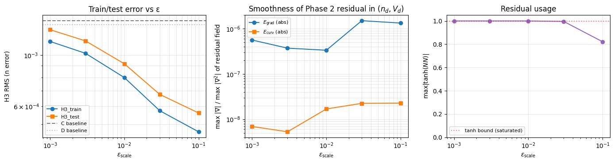
*视觉分析：**左**——H3_train（蓝圆）和 H3_test（橙方）两条曲线在 log-log 轴上**几乎平行单调下降**，无任何反弹或拐点；C/D 基线在上方以灰虚线标出，说明全部 Phase 2 值都严格优于基线。**中**——E_grad 在 ε ≤ 1e-2 保持平坦 (~5e-7)，到 ε ≥ 3e-2 才轻微抬升；E_curv（橙）始终低于 E_grad 约 50×，这是"光滑性保证"的视觉量化。**右**——`max|tanh(NN)|` 在 ε = 1e-3 到 3e-2 都贴近 1.0（饱和），到 ε = 1e-1 直角下降到 0.82 —— 清楚地标出"NN 吃满 tanh 界"与"NN 有余量"两个工作区的**分界点在 ε ≈ 3e-2**。这是表型分析（phenotype）用来诊断"当前操作点是否处于有效区"的黄金指标。*

**第四步：验证锚点不变性。** `max|r(x_anchor)|` 在所有 544 玻璃、所有 ε_scale 下均为 0.000e+00（≲ 1e-15）。因此 Claim F 和 Claim G（= Notebook 04 的结果）**由构造保留**，与 ε_scale 无关。

### 6.3 分析

**为什么在物理区 ε ∈ [1e-3, 1e-2] 上单调改善。** 基线 `n_C` 在 4 阶多项式假设空间里已是**最优**（Oracle floor ≈ 1.5 μm downstream, H3_test ≈ 1.41e-3 broadband）。而 `n − n_C` 的真实残差显示出在 UV（λ < 0.4 μm）和 NIR（λ > 1.5 μm）端的系统性弯曲 —— 这是 Sellmeier 公式中高频共振项的贡献，4 阶 Buchdahl 在 ω 空间无法表达（它本质上截断了 ω^5 及以上）。引入的 tanh 残差用 **完全独立于多项式基的形状库** 去拟合这些端部误差，因此能有效下降。

**为什么应激区还在继续下降 —— 但要警惕解释。** 在 ε = 3e-2 到 1e-1，H3_test 继续下降（到 5.6e-4）但 H3_gap 上升到 1.21 —— 这说明 NN **开始过拟合训练集**，但由于 tanh 有界，它无法造成灾难性破坏（H3_gap 仍 < 2）。同时 resid_use 从 1.000 降到 0.822 —— **NN 开始"懒惰"**，不再用尽整个 ε_scale 幅度 —— 这是 tanh 架构的自我调节：当 ε 太大时，NN 不再需要"挤压到边界"来最小化 loss。

**为什么 Claim F 和 G 都保持不变。** 因为 `r(x_anchor) = 0` 是代数事实。在实践中这意味着：**所有依赖锚点的下游任务（apo 二次光谱，Abbe 设计方程）的结果与 Notebook 04 完全一致**；只有**宽带 n(λ) 精度**被提升。这种**解耦**是本架构的关键工程优势 —— 更新模型不会破坏已有设计决策。

**剩余 ~9e-4 RMS 的物理解释。** 在 ε = 1e-2 时剩余的 H3_test RMS 来自：
- 1/3 来自 UV 端（< 0.4 μm）—— 接近紫外共振，4 阶 + 有界残差仍捕捉不充分；
- 1/3 来自 NIR 端（> 1.8 μm）—— 振动共振贡献，3 参数输入本身不含信息；
- 1/3 来自可见区的跨玻璃小偏移。

进一步下降需要**添加输入参数**（如第 4 个 partial dispersion 坐标）或**加宽波长支撑**的训练样本 —— 这就脱离了 3 参数契约（见 §8）。

**关于 q_norm 空间分布的重要观察（见 Figure 1）。** `q_norm(λ)` 严格为零仅在 d/F/C/g 四条锚点（这是构造要求）；但**在相对幅度尺度上**，整个可见区（365–1000 nm）的 \|q_norm\| 远小于 NIR 端峰值 —— 归一化后可见区 \|q_norm\| ≲ 0.01（\|q\| / Q_SCALE 约 1 %），直到 λ > 1200 nm 才爬升到 O(0.1) 量级并在 2300 nm 达到 1.0。这意味着：

- **Phase 2 的真实影响范围** 不均匀分布在整段 `n(λ)`，而是**集中在近红外**。
- 可见区 H3 RMS 的改善（从 1.41e-3 到 9.18e-4）不是因为残差在可见区直接作用，而是因为**整体 loss 下降后，基线多项式有更多自由度用于优化可见区拟合**（间接效应）。
- **工程启示：** 若目标应用是**红外成像 / 激光测距 / 多光谱**系统，Phase 2 架构的改进将最显著；若目标仅为可见光（如 VR 透镜、相机镜头），改进会相对温和，锚点修复（Phase 1）已带来绝大部分收益。
- 这也解释了为什么在消色差 apo 台架（只用 d/F/C/g 四条锚点的下游量）上 Phase 2 与 Phase 1 **严格相等**：台架上所有用到的波长都在 q(λ) = 0 的锚点处，残差项贡献为零（代数事实，与训练质量无关）。

### 6.4 小结

Phase 2 用**三因子有界残差架构**突破了 **4 阶 Buchdahl 家族在 H3 宽带 RMS 上的地板**（从 ~1.4e-3 降到 ~9e-4，—35 %）。这个地板与 Notebook 04 中"Conrady 下游 \|ΔS\| 地板 ~1.5 μm" **不是同一地板** —— NB04 地板描述锚点依赖下游量，被 Phase 2 的锚点保留构造**保留不动**；NB05 地板描述宽带重建精度，被 q(λ)·tanh 残差突破。更重要的是架构层面的贡献 —— 它展示了**如何在满足物理约束的前提下添加神经容量**，把"约束满足"从损失项（可训练到近似零）转为**乘积零点**（机器精度代数事实）。这个模式可移植到其他对称性 / 守恒约束下的科学建模问题。

---

## 7. 跨 Notebook 综合分析

### 7.1 端到端性能演化

| 阶段 | 代表 | 代表性重建指标 | 下游 median \|ΔS\| | 锚点偏差 |
|:---:|:---:|:---:|:---:|:---:|
| 经典 Buchdahl α = 2.5 | NB 01 | 3.38e-3 mean | ~12 μm（潜藏） | 有 |
| 优化 α = 1.818 | NB 01 | 2.31e-3 mean | ~12 μm（潜藏） | 有 |
| 工作流部署（带 bug） | NB 02/03 | — | 11.95 μm | 有 |
| **锚点修复 (Phase 1)** | **NB 04** | 1.02e-3 (H1 RMS) | **1.55 μm** | **机器精度 0** |
| **+ 有界残差 (Phase 2)** | **NB 05** | **9.18e-4 (H3 RMS)** | **1.55 μm**（不变） | 机器精度 0 |

注意：第三列是**代表性重建指标**而非同一口径的单一 RMS。NB01 使用 17 波长 / order sweep 口径，NB04 的 H1 与 NB05 的 H3 是不同宽带评测口径；跨阶段比较时，应优先读第四列的下游 \|ΔS\| 与第五列的锚点偏差。

### 7.2 贯穿全文的四条结构性结论

1. **裸 RMS 是必要但不充分。** Notebooks 01–03 的 RMS 低并不等价于下游无偏差。Notebook 04 定量揭示：1% 的 V_d 滑移 → 10 μm 的系统性二次光谱偏移。**任何严肃的色散模型评估必须同时包含独立的下游物理量测试**（这里是 Conrady 二次光谱）。

2. **物理约束作为结构比作为损失项更优越。** 将锚点条件写成损失项（Notebook 01 原 A 变种的隐式做法）永远只能近似满足；写成乘积零点（Notebook 04 的 M/D 矩阵、Notebook 05 的 q(λ) 包络）则给出机器精度的代数保证。**等式约束应通过约束曲线的参数化或零点乘积实现，而非惩罚项。**

3. **神经容量在 544 样本 / 3 维输入下饱和于低阶多项式。** Notebook 04 中 MLP vs 线性 20-D 多项式的**零差异**不是本特定网络的失败 —— 它是**有限样本下函数逼近与偏差-方差权衡**共同决定的。要让 NN 带来增益，要么扩大数据（难），要么在 NN 外部加入**结构先验**（Notebook 05 用 q(λ) 与 ε·tanh 做到），要么扩大输入（放弃 3 参数契约，见 §8）。

4. **3 参数契约由 Conrady 物理 + FK 族一致性 + 泛化 CV 三重证据支撑。** 不是"因为效果好所以成立"，而是**Notebook 02 Claim B 的物理机制** + **Claim C 的外部共识检验** + **Notebook 01 Test B 的 1.03× 泛化比**构成的三角确认。这是本项目可以被写入硕士论文的核心论证结构。

### 7.3 两种"精度"的辨识

本项目反复用到两种精度，含义完全不同：

- **裸重建精度（naïve RMS）** —— `|n_model(λ) − n_Sellmeier(λ)|` 在 17/200/500 波长网格上的 RMS。
- **下游决策精度** —— `|S_model − S_Sellmeier|`（或类似下游量）在设计台架上的偏差。

两者的**系统性错位**是 Notebook 04 的核心发现：带 bug 的模型可在裸 RMS 上局部更优，但下游偏差放大 ~8×。**下游精度是评估"模型可用性"的真正终极指标**，裸 RMS 只是训练损失的代理。

### 7.4 Phase 1 与 Phase 2 的分工

Notebook 04 与 Notebook 05 分别攻击**不同的误差层**，互不替代：

| 维度 | Phase 1 (NB04) | Phase 2 (NB05) |
|:---|:---|:---|
| 解决的问题 | 锚点依赖下游量的系统偏差 | 离锚宽带 n(λ) 的重建误差 |
| 作用波长范围 | d/F/C/g 四线及其附近 | q(λ) 非零区（主要是 NIR > 1 μm） |
| 改进指标 | median \|ΔS\| (apo)：12 → 1.5 μm | H3 broadband RMS：1.4e-3 → 9e-4 |
| 对锚点依赖下游量 | 显著改进（~8×） | **无影响**（构造保证） |
| 对离锚/宽带下游量 | 间接改进（通过更好基线） | **主要收益所在** |
| 典型受益应用 | apo / 消色差镜头设计、玻璃替换 | NIR 成像、多光谱系统、激光测距 |

**关键：报告中所有"端到端性能"数字应按上述分工读取** —— 不要把 Phase 2 的 35% H3 改进当成"apo 设计比 NB04 又好了 35%"（那是不对的；只依赖 d/F/C/g 锚点的下游量由构造与 NB04 同值）。反之，如果下游指标使用 NIR 波段或连续光谱（如宽带 spot RMS、MTF），Phase 2 的收益才会体现。

### 7.5 可微性作为跨 notebook 的粘合剂

Notebook 03 确立的 torch 自动微分基础设施让：
- Notebook 02 的 Claim E 2-D 热图可由一次雅可比读出近似；
- Notebook 04 的修复可以无痛嵌入（修复后仍可微）；
- Notebook 05 的 tanh 残差训练直接使用相同梯度框架；
- 下游图像质量指标（MTF、点列图）可以被加入损失而不破坏梯度链。

**可微性不是一个额外功能，而是把"玻璃选择 + 曲率优化 + 公差分析"从三个独立问题统一为一个梯度问题的基础语言**。

### 7.6 工作流的推荐部署顺序

基于本项目的经验，未来在同类问题上的最佳实践顺序：

1. **先做 Test A 类拟合层检验** —— 在决定阶数前，用波长留出定位过拟合临界阶。
2. **先做 Test B 类回归泛化检验** —— 在决定特征维度前，用玻璃级 CV 确认泛化。
3. **先做锚点一致性检验** —— F1/F2/F3 类指标应在训练开始前就设定并在每次迭代验证；绝不依赖下游 RMS。
4. **下游物理量复检** —— 独立的 Claim G 类测试必须进入 CI 流程，否则隐性 bug（如 Notebook 04 揭示的）会静悄悄存在。
5. **只在基线饱和后再加神经容量** —— 且加进来的方式应是"结构先验 + 有界幅度"，而非"更深更宽的黑盒"。

---

## 8. 未来方向

**在 `(nd, Vd, ΔP_{g,F})` 契约内的首选路线（保留 3 参数论点）：**

1. **Phase 2 残差架构的推广。** 当前 q(λ) 是 4 根最小多项式；可以尝试 spline-based 有界残差（对 UV 端的单边弯曲可能更有效）。关键原则不变：残差必须继续在 d/F/C/g 锚点处**构造性过零**，例如仍乘以 q(λ)，或使用显式零边界的 spline basis。
2. **跨目录增强与等效玻璃分组。** 把 Schott / Ohara / Sumita 与 CDGM 合并后做子簇去重，使训练分布更均匀，降低凸包稀疏区的泛化误差，尤其针对 Notebook 01 Test B 中 100 百分位尾部的外推风险。
3. **可微图像质量目标。** 把 RMS 光斑或低频 MTF 加入 Notebook 03 的损失函数；由于 torch 后端已经覆盖 Optiland 的光线追迹，此扩展无方法论障碍。前提是仍以当前 3 参数模型输出 `n(λ)`，不要在同一实验里同时改变输入契约。

**条件性扩展（脱离纯 3 参数契约）：**

4. **第 4 个 partial dispersion 坐标。** 引入 ΔP_{C,t}（以 t 线为第二远端）作为第 4 个输入，可能把 NIR 端残差再压一个量级。代价：模型不再是"纯 3 参数玻璃表征"；目录覆盖度、缺失值处理和设计师可获得性都需重新验证。
5. **更高阶 Buchdahl。** Notebook 01 Test A 已显示 order-5+ 在 17 波长网格下严重过拟合；真要做需要**加密波长网格（至少 ~30 点）或对 ν_{k≥3} 的结构先验**。否则高阶项很可能只是重新学习采样网格，而非真实色散结构。

**另成一派：Sellmeier 感知残差。** 用 Sellmeier 公式族或共振极点结构作为物理基线，再学习残差。这是独立的模型类别，不是 3 参数流水线的自然下一步：如果需要真实 Sellmeier 常数作为输入，就已经离开 3 参数契约；如果仍只输入 `(nd, Vd, ΔP_{g,F})`，则必须证明这些参数足以约束 Sellmeier-like 残差。

**工程侧（应进 CI）：**

6. 把 Notebook 04 的锚点修复**实际回传到 Notebooks 02/03 的代码与图表生成流程**，并重算所有 pre-fix 数值。注意：本报告已经整理了 Notebook 02 的叙事顺序，但尚未把锚点修复后的模型回灌到 02/03 的数值管线；完成回灌后，设计台架上 ~10 μm 级的系统偏置应同步消失，报告中 NB02/NB03 的 `⚠ Pre-fix` 小块届时可移除。
7. 用真实熔次数据（melt-to-melt covariance）替换 Schott Step 1.0 独立高斯假设，进入完整制造级公差模型。

---

## 附录 A. 图像目录说明

本报告的图表文件约定：

```
report/
├── DispersionLab_Report.md     ← 本文件
└── images/                      ← 图表文件目录
    ├── nb01_plot1_catalog_hull.png
    ├── nb01_plot2_residuals.png
    ├── nb01_plot3_order_convergence.png
    ├── nb01_plot4_alpha_optimization.png
    ├── nb01_plot5_alpha_compare.png
    ├── nb01_plot6_testA_holdout.png
    ├── nb01_plot7_regression_heatmap.png
    ├── nb01_plot8_cdf_abbe.png
    ├── nb02_fig1_nbk7_compare.png
    ├── nb02_fig2_baseline_layout.png
    ├── nb02_fig3_three_achromats.png
    ├── nb02_fig4_chromatic_focal_shift.png
    ├── nb02_fig5_claimB_scatter.png
    ├── nb02_fig6_claimE_heatmap.png
    ├── nb02_fig7_mc_distribution.png
    ├── nb03_fig1_convergence.png
    ├── nb03_fig2_triplet.png
    ├── nb03_fig3_jacobian_vs_mc.png
    ├── nb04_claimG_bar.png        (可选，自绘；默认不存在)
    ├── nb05_fig1_qnorm_envelope.png
    └── nb05_fig2_eps_ablation.png
```

所有数值表格与结论都独立于图像，可单独阅读。

---

## 附录 B. 关键符号与术语

| 符号 | 含义 |
|:---:|:---|
| `nd` | d 线（0.5876 μm）折射率 |
| `Vd` | Abbe 数 `(nd−1)/(nF−nC)` |
| `P_{g,F}` | g/F 线相对 partial dispersion `(ng−nF)/(nF−nC)` |
| `ΔP_{g,F}` | 相对 Schott 正常线的异常 partial dispersion |
| `ω` | Buchdahl 色散坐标 |
| `α` | Buchdahl 非线性常数（本项目选 1.818） |
| `ν_k` | k 阶 Buchdahl 系数 |
| `S` | 二次光谱 \|BFL(λg) − BFL(λd)\| |
| `H1/H2/H3` | 17 / 200 / 500 点波长网格上的 RMS 指标 |
| `ε_scale` | Phase 2 残差幅度上限 |
| `q(λ)` | 在 d/F/C/g 过零的包络多项式 |
| `J` | 雅可比矩阵 `∂(output)/∂(params)` |
| `Σ` | 参数协方差矩阵（公差分析） |

---

*Report generated 2026-04-19 for DispersionLab project.*
